

#  Plataforma de análisis de datos de matriculados en la carrera de ingeniería de sistemas para la universidad privada de Tacna - PAMIS

El propósito de PAMIS es proporcionar una plataforma tecnológica que permita a los estudiantes de la Escuela Profesional de Ingeniería de Sistemas abordar varios desafíos relacionados con el análisis del desempeño académico de sus compañeros. Estos desafíos incluyen la falta de acceso a herramientas analíticas detalladas, la necesidad de identificar patrones de rendimiento a lo largo del tiempo y la importancia de tomar decisiones estratégicas basadas en datos concretos.

## Integrantes
- **Agreda Ramirez, Jesus Eduardo			(2021069823)** 
- **Castañeda Centurion, Jorge Enrique		(2021069822)** 
- **Contreras Lipa, Alvaro Javier			(2021070020)** 
- **Málaga Espinoza, Ivan Francisco		(2021071086)**
- **Ortiz Fernandez, Ximena Andrea			(2021071080)**

## Curso
- Inteligencia de Negocios

## Docente
- Mag. Patrick Cuadros Quiroga

## Enlace a los datos
-  [Consolidado Semestre 2020 - I](https://docs.google.com/spreadsheets/d/1cIg5tDGIJB3h0LbpFJx4EUgkOMIlYVMK/edit?usp=sharing&ouid=105683032286356296046&rtpof=true&sd=true)

-  [Consolidado Semestre 2020 - II](https://docs.google.com/spreadsheets/d/1eaYI-YMzZYpGdQ3vCbRQ28YCHEucd3Fi/edit?usp=sharing&ouid=105683032286356296046&rtpof=true&sd=true)

-  [Consolidado Semestre 2021 - I](https://docs.google.com/spreadsheets/d/1oR_VQalTpQ3ZywmnBypG0NKYe4vTw7sf/edit?usp=sharing&ouid=105683032286356296046&rtpof=true&sd=true)

-  [Consolidado Semestre 2021 - II](https://docs.google.com/spreadsheets/d/1x3-4pQaRQgEPI5ymfbOjxNAuNmJLEyI3/edit?usp=sharing&ouid=105683032286356296046&rtpof=true&sd=true)

-  [Consolidado Semestre 2022 - I](https://docs.google.com/spreadsheets/d/1rwH7N_DOPicpMzaNN9rf5wD1CHzeQA0E/edit?usp=sharing&ouid=105683032286356296046&rtpof=true&sd=true)

-  [Consolidado Semestre 2022 - II](https://docs.google.com/spreadsheets/d/10kJhI5DXXkWpJ0_mLp-LQxszpHnUWk9N/edit?usp=sharing&ouid=105683032286356296046&rtpof=true&sd=true)

-  [Link del reporte en PowerBI](https://app.powerbi.com/reportEmbed?reportId=0d97ad35-6197-41f4-8ff7-8956d59f99c0&autoAuth=true&ctid=b6b466ee-468d-4011-b9fc-fbdcf82ac90a)

## Diagramas Mermaid

- Diagrama de clase

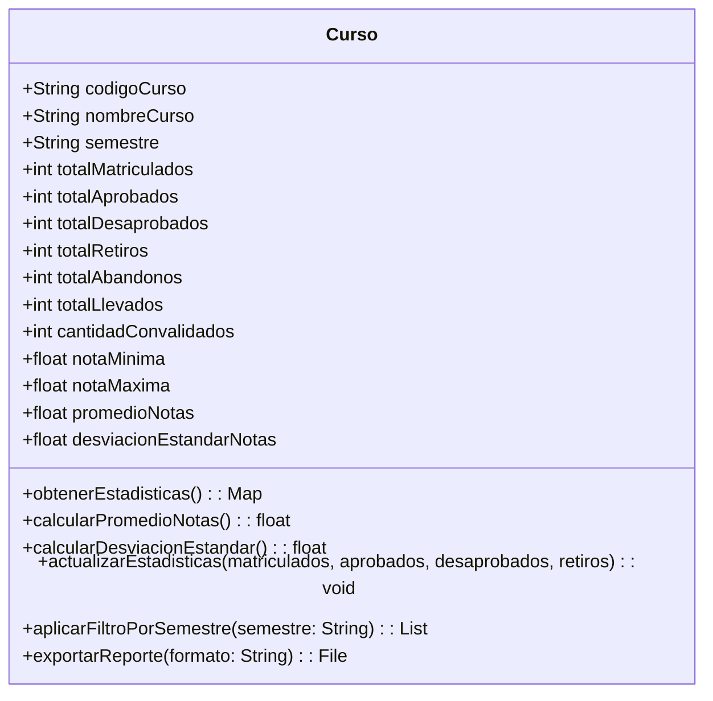

- Diagrama Contenedor
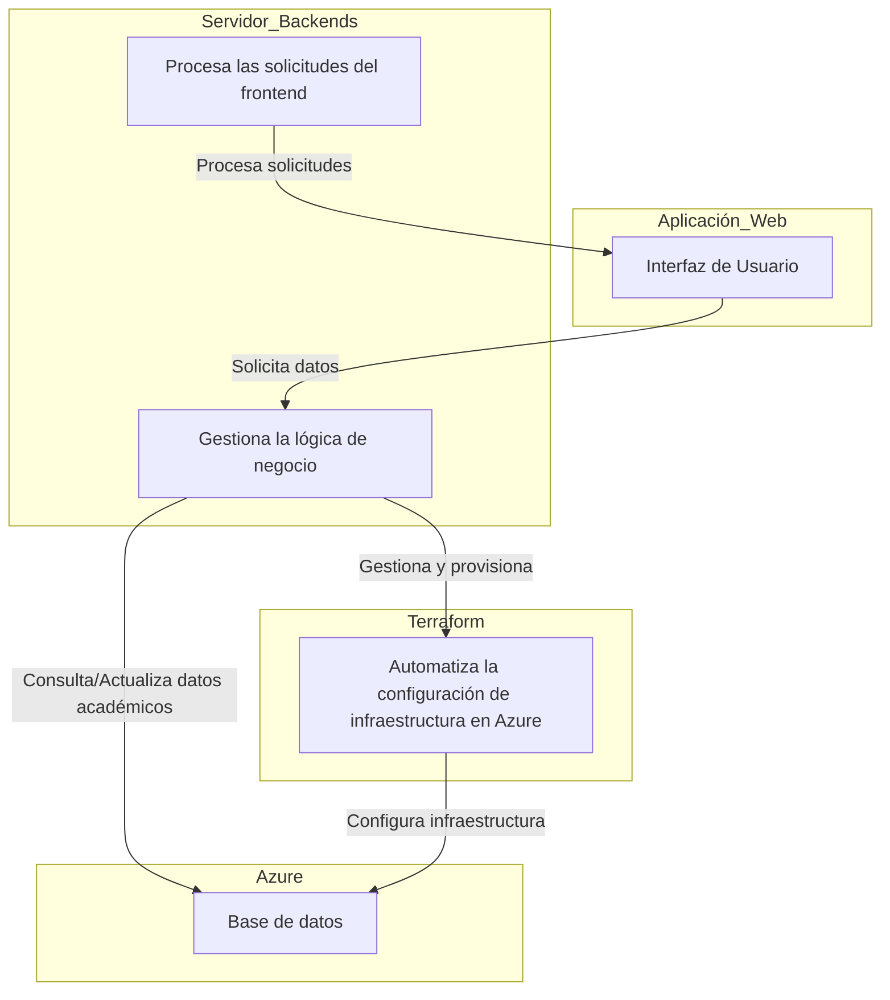

- Diagrama Contextual
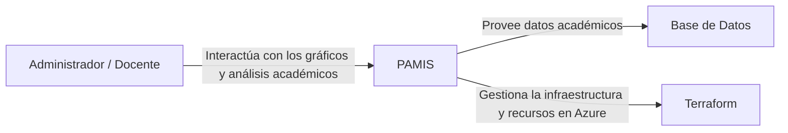

- Diagrama de Actividades CU-01 “Consultar estadísticas académicas”
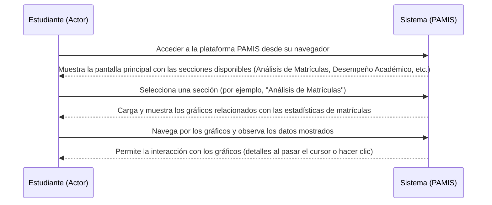

-Diagrama de Actividades CU-02 “Aplicar filtros a los gráficos”
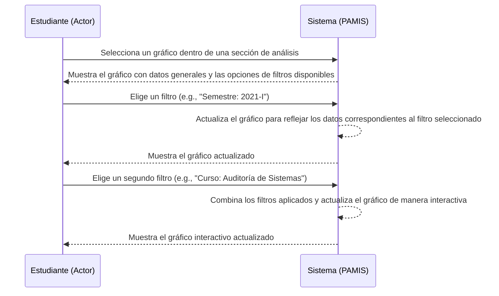
-Diagrama de Actividades CU-03 “Exportar reportes”
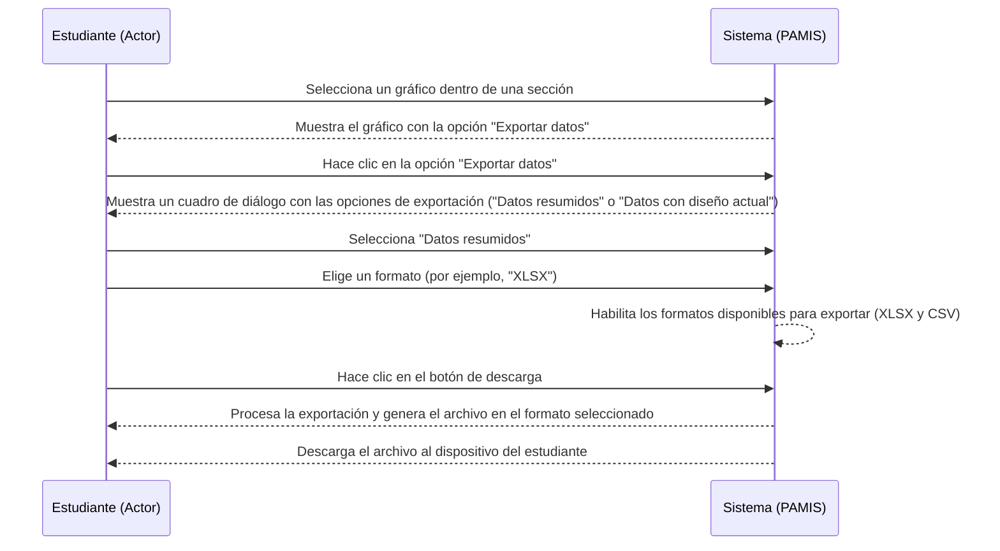

-Diagrama de actividades Inicial
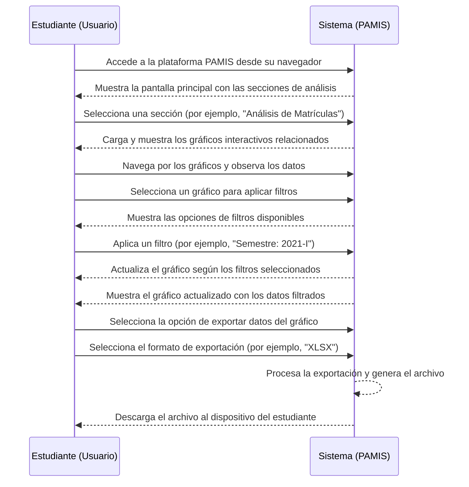

-Diagrama de componentes
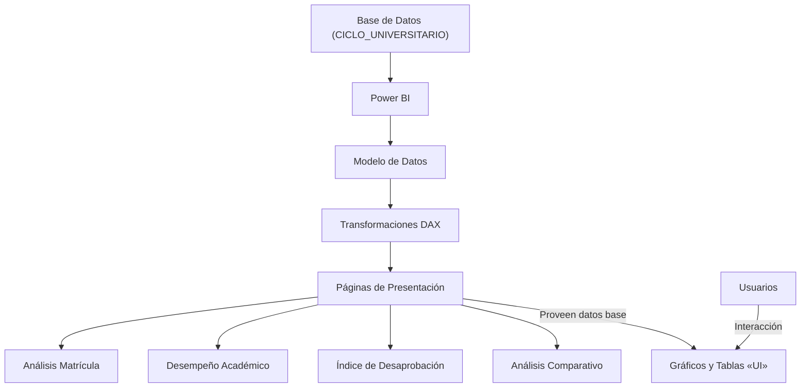

-Diagrama de Paquetes
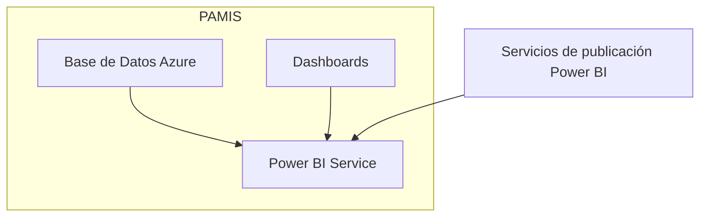

-Diagrama de Proceso Propuesto
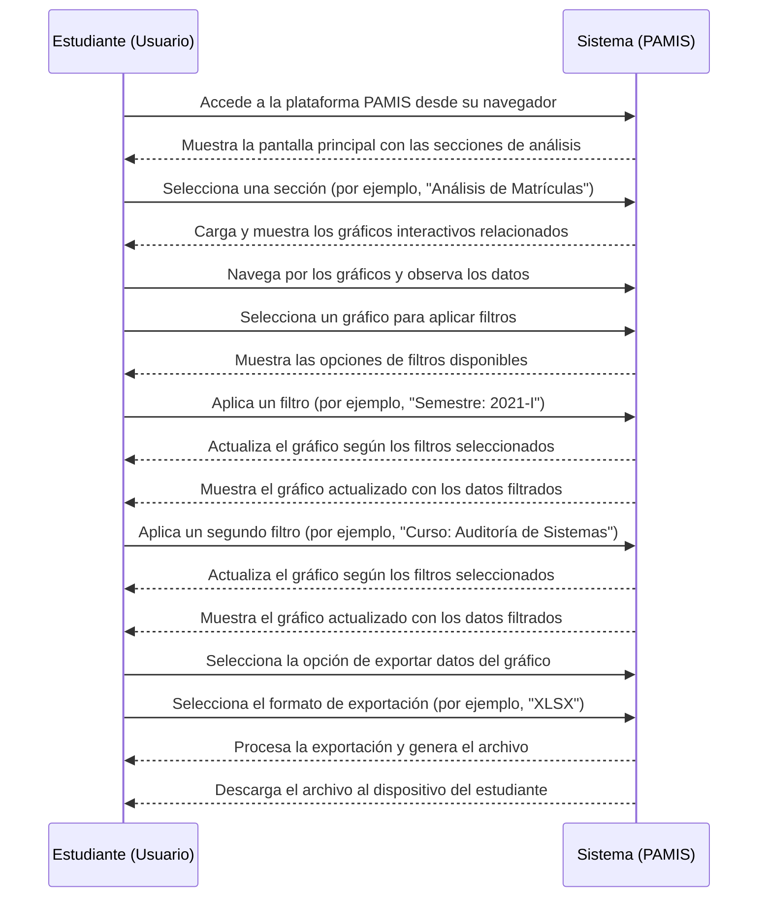
-Diagrama de Secuencia de CU01 “Consultar estadísticas académicas”
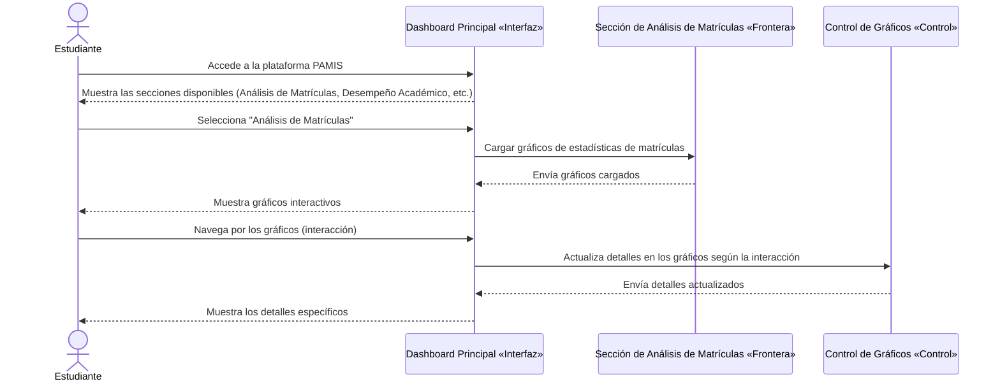

-Diagrama de Secuencia de CU02 “Aplicar filtros a los gráficos”
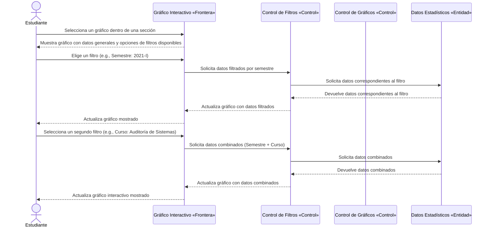
-Diagrama de Secuencia de CU03 “Exportar reportes”

-Diagrama ER
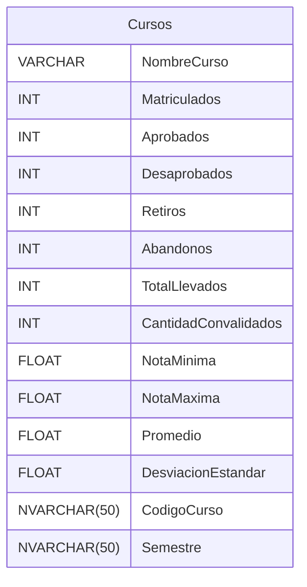
-Organigrama
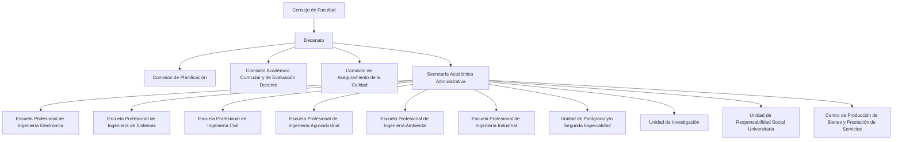