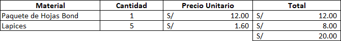
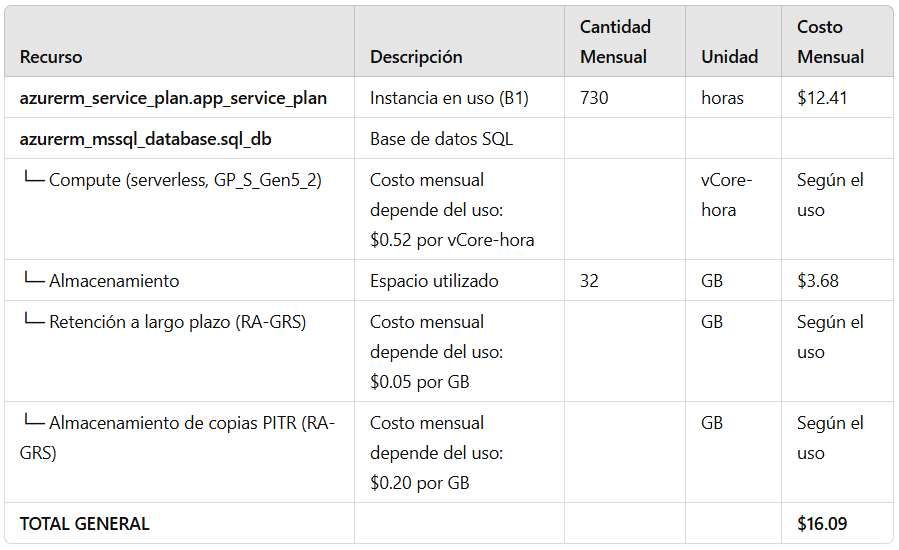
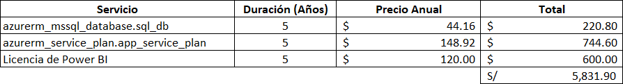
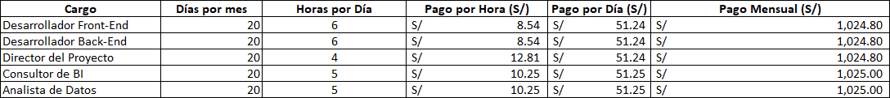
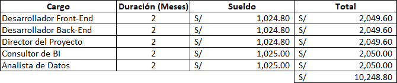
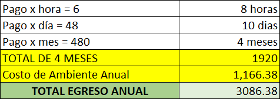
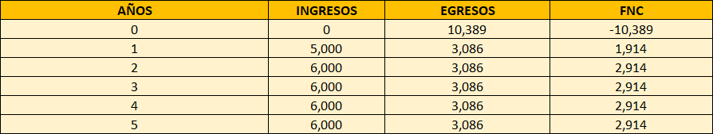

# UNIVERSIDAD PRIVADA DE TACNA  
## FACULTAD DE INGENIERÍA  
### Escuela Profesional de Ingeniería de Sistemas

**Plataforma de análisis de datos de matriculados en la carrera de Ingeniería de Sistemas para la Universidad Privada de Tacna - PAMIS**

Curso: *Inteligencia de Negocios*  
Docente: *Mag. Patrick Cuadros Quiroga*

**Integrantes:**

Agreda Ramirez, Jesus Eduardo  &emsp;&emsp;&emsp;&emsp;- &emsp;  (2021069823)
 Castañeda Centurion, Jorge Enrique &emsp; - &emsp; (2021069822)
 Contreras Lipa Alvaro Javier &emsp;&emsp;&emsp;&emsp;&emsp;&ensp; - &emsp;  (2021070020)
 Malaga Espinoza, Ivan Francisco &emsp;&emsp;&ensp; - &emsp; (2021071086)
 Ortiz Fernandez, Ximena Andrea &emsp;&emsp;&ensp; - &emsp;  (2021071080)

**Tacna – Perú**  
***2024***

\pagebreak

# **Informe de Factibilidad**

**Plataforma de análisis de datos de matriculados en la carrera de Ingeniería de Sistemas para la Universidad Privada de Tacna - PAMIS**

**Versión 2.0**

## **Control de Versiones**

| Versión | Hecha por | Revisada por | Aprobada por | Fecha      | Motivo           |
| :-----: | --------- | ------------ | ------------ | ---------- | ---------------- |
| 1.0     | JCC       | ACL          | JAR          | 27/08/2024 | Versión Original |
| 2.0     | XOF       | JAR          | IME          | 15/11/2024 | Versión Original |

\pagebreak

## **Índice General**

1. [Descripción del Proyecto](#_Toc52661346)  
   1.1 Nombre del proyecto  
   1.2 Duración del proyecto  
   1.3 Descripción  
   1.4 Objetivos  

2. [Riesgos](#_Toc52661347)  

3. [Análisis de la Situación Actual](#_Toc52661348)  
   3.1 Planteamiento del problema  
   3.2 Consideraciones de hardware y software  

4. [Estudio de Factibilidad](#_Toc52661349)  
   4.1 Factibilidad Ténica  
   4.2 Factibilidad Económica  
   4.3 Factibilidad Operativa  
   4.4 Factibilidad Legal  
   4.5 Factibilidad Social  
   4.6 Factibilidad Ambiental  

5. [Análisis Financiero](#_Toc52661350)  

6. [Conclusiones](#_Toc52661351)  

\pagebreak

# **Informe de Factibilidad**

## 1. Descripción del Proyecto 

### 1.1. Nombre del proyecto

Plataforma de análisis de datos de matriculados en la carrera de ingeniería de sistemas para la universidad privada de Tacna - PAMIS.

### 1.2. Duración del proyecto

<strong>Inicio:</strong> 24 de Agosto del 2024  
<strong>Fin:</strong> 13 de Diciembre del 2024

El proyecto tendrá una duración aproximada de 17 semanas.

### 1.3. Descripción

Este proyecto se centra en desarrollar una herramienta analítica para la Escuela Profesional de Ingeniería de Sistemas de la UPT. Su principal propósito es permitir a los estudiantes acceder a estadísticas detalladas sobre los cursos. Al ofrecer datos como tasas de aprobación, índices de deserción y distribución de calificaciones, la herramienta ayudará a los estudiantes a tomar decisiones informadas sobre su trayectoria académica. Cubriendo la necesidad de mejorar la experiencia educativa mediante el acceso a información relevante y personalizada.

### 1.4. Objetivos

#### 1.4.1. Objetivo general

Desarrollar una plataforma de análisis de datos de matriculados en la carrera de ingeniería de sistemas para la universidad privada de Tacna que permita a sus estudiantes, acceder a estadísticas detalladas sobre los cursos, con el fin de mejorar la toma de decisiones académicas y optimizar su rendimiento.

#### 1.4.2. Objetivos Específicos

## Análisis de Matrículas:
- **Objetivo:** Proporcionar una visión clara sobre las tasas de matriculación y su evolución a lo largo del tiempo para identificar tendencias y patrones de inscripción.
- **Meta:** Facilitar la identificación de picos o caídas en las matrículas, ayudando en la planificación de recursos y estrategias de captación.

## Desempeño Académico por Curso:
- **Objetivo:** Evaluar el rendimiento académico en cada curso a través de la visualización de tasas de aprobación y calificaciones.
- **Meta:** Ofrecer a los estudiantes una comprensión detallada de su desempeño y motivarlos a mejorar en áreas específicas.

## Análisis Comparativo entre Cortes:
- **Objetivo:** Realizar comparaciones del rendimiento académico entre diferentes generaciones de estudiantes para identificar cambios y tendencias a lo largo del tiempo.
- **Meta:** Proporcionar información que ayude a entender cómo diferentes cohortes responden a los planes de estudio y a las metodologías de enseñanza.

## Identificación de Áreas Críticas:
- **Objetivo:** Detectar cursos o áreas académicas con un alto índice de desaprobación para implementar estrategias de mejora.
- **Meta:** Informar a la administración y a los docentes sobre los cursos que requieren atención adicional, promoviendo acciones correctivas oportunas.

## Análisis de Matriculados por Docente:
- **Objetivo:** Evaluar el rendimiento de los estudiantes en relación con los docentes a través de la tasa de aprobación y la probabilidad de éxito.
- **Meta:** Proporcionar información valiosa sobre la efectividad docente y permitir ajustes en la asignación de cursos, buscando mejorar la experiencia académica.

\pagebreak

## 2. Riesgos 

- **Fallas técnicas:**
Problemas con la infraestructura tecnológica, como servidores, bases de datos o integraciones de software, que podrían afectar la disponibilidad y el rendimiento de la plataforma.

- **Corto tiempo para el desarrollo del proyecto:**
El plazo asignado para completar el desarrollo es demasiado corto para alcanzar los estándares de calidad y funcionalidad deseados, lo que podría generar presión excesiva en el equipo de desarrollo y resultar en un producto final deficiente.

- **Disponibilidad limitada del personal:**
La posibilidad de que algunos miembros del equipo no estén disponibles debido a conflictos de horario, enfermedades, renuncias inesperadas u otros compromisos, lo que puede provocar retrasos en el desarrollo, aumentar la carga de trabajo del resto del equipo y afectar la calidad del producto final.

- **Sobrecarga de datos:**
La acumulación de grandes volúmenes de datos sin una estrategia clara para su manejo puede ralentizar el sistema y dificultar el análisis eficaz.

- **Seguridad de datos:**
Las vulnerabilidades en la protección de datos personales y académicos, lo que podría resultar en brechas de seguridad y pérdida de confianza por parte de los usuarios.

\pagebreak

## 3. Análisis de la Situación Actual 

### 3.1. Planteamiento del problema

En la actualidad, los estudiantes de la Escuela Profesional de Ingeniería de Sistemas de la Universidad Privada de Tacna (UPT) enfrentan diversos desafíos en la gestión de su rendimiento académico. Estos desafíos incluyen la falta de herramientas adecuadas para acceder a estadísticas detalladas sobre los cursos, la dificultad para tomar decisiones informadas basadas en datos claros y la ausencia de una plataforma centralizada para visualizar su progreso académico.

+ **Falta de acceso a información académica personalizada:**
La escuela dispone de un sistema administrativo que gestiona las estadísticas académicas a nivel institucional. Sin embargo, los estudiantes no tienen acceso directo a una plataforma que les permita visualizar de manera clara y personalizada datos como tasas de aprobación, índices de deserción y distribución de calificaciones en los cursos que les interesan. Esto limita su capacidad para evaluar y planificar su trayectoria académica de manera efectiva.

    
+ __Dificultades para tomar decisiones informadas:__
La carencia de herramientas accesibles y comprensibles para los estudiantes implica que deben tomar decisiones basadas en percepciones o información incompleta. Esta situación puede llevar a una planificación académica menos eficaz y a un rendimiento subóptimo en los cursos.

    
+ **Impacto en el rendimiento académico:**
Sin acceso a una visión detallada y precisa de su rendimiento académico, los estudiantes pueden enfrentar dificultades para identificar áreas de mejora y ajustar su enfoque de estudio, lo que afecta negativamente su desempeño y progreso académico.

+ **Necesidad de una plataforma de visualización de datos:**
Es fundamental desarrollar una herramienta analítica que permita a los estudiantes acceder a estadísticas relevantes y personalizadas sobre los cursos. Esta plataforma debería facilitar la toma de decisiones informadas, mejorar la planificación académica y optimizar el rendimiento académico de los estudiantes.

### 3.2. Consideraciones de hardware y software

<u>*Hardware*</u>

**Computadora de Desarrollo:**

Computadoras con hardware suficiente para ejecutar Visual Studio Code y diversos programas para la implementación del sistema. Se recomienda una computadora con al menos un procesador de cuatro núcleos, 8 GB de RAM y un disco duro sólido (SSD) para un rendimiento óptimo.

- Acer Nitro 5
- MacBook Air 2017
- HP Victus 15

**Memoria RAM:**

Visual Studio Code puede consumir recursos considerables, especialmente al compilar y ejecutar la aplicación. Por lo tanto, contar con suficiente memoria RAM es esencial para evitar la ralentización del sistema.

- 16 GB de RAM

**Procesador:**

El procesador de los equipos de trabajo debe ser altamente potente, con varios núcleos e hilos para procesar la información del software utilizado.

- Intel Core i5 12500H (12 núcleos y 8 hilos)

**Tarjeta Gráfica:**

Los equipos de trabajo deben contar con una GPU dedicada, necesaria para realizar cálculos paralelos de manera eficiente, acelerar el entrenamiento y ejecución de modelos de inteligencia artificial, mejorar la interactividad y el rendimiento de la aplicación, y facilitar el procesamiento de gráficos para visualizaciones de datos y elementos gráficos avanzados.

- Nvidia RTX 3050
- Intel HD Graphics 6000 (1536 MB)

<u>*Software*</u>

- **Sistema Operativo:**

Los programas utilizados para el desarrollo de la aplicación web son compatibles con Windows y macOS.

- **Visual Studio Code:**

Es necesario instalar Visual Studio Code (versión 1.89), que es un entorno de desarrollo integrado (IDE) ligero y altamente personalizable. Se pueden agregar extensiones específicas para ayudar en el desarrollo del sistema.

- **Power BI:**

Se usará para crear informes, gráficos interactivos y el dashboard principal; integrando datos de diversas fuentes para facilitar la toma de decisiones.

\pagebreak

<h2 id="_Toc52661349">4. Estudio de Factibilidad</h2>

### 4.1. Factibilidad Técnica

**Hardware Disponible**

- **Equipos de Desarrollo:** 
Se necesitan equipos de desarrollo capaces de ejecutar software de desarrollo web y herramientas de análisis de datos. Los materiales previamente mencionados cumplen con las especificaciones mínimas requeridas:

  - *Procesador:* Intel Core i5 de 4 núcleos, útil para el manejo de tareas de programación, depuración y pruebas.

  - *Memoria RAM:* De 8 a 16 GB de memoria DDR4 expandible.

  - *Almacenamiento:* Disco duro sólido (SSD) para el sistema operativo. Esto asegura tiempos de carga cortos y un óptimo rendimiento general.

  - *Tarjeta Gráfica:* Se usa la tarjeta gráfica integrada en el procesador Intel, pero también se puede hacer uso de una GPU dedicada como la Nvidia RTX 3050.

**Software**

- **Aplicaciones y Herramientas de Desarrollo:**

  - *Visual Studio Code:* Es el IDE principal para el desarrollo del proyecto, siendo compatible con los sistemas operativos Windows y macOS, ofreciendo extensiones que personalizan el entorno de trabajo.
  
  - *Terraform:* Utilizado para la creación y gestión automatizada de la infraestructura en Azure, asegurando consistencia y escalabilidad.

  - *Power BI:* Herramienta es para la creación de dashboards y visualizaciones de datos interactivos, además de ser poderosa para los análisis de datos.

  - *Azure SQL Database:* Base de datos transaccional utilizada para la gestión de datos académicos.

  
- **Navegadores Web:** La plataforma debe ser compatible con los navegadores web más conocidos y utilizados tales como Google Chrome, Mozilla Firefox, Microsoft Edge, etc.

**Infraestructura en la Nube**

- **Grupo de Recursos:** Contenedor lógico llamado inteligencia-negocios, que organiza todos los recursos relacionados en la ubicación East US.

- **Azure SQL Server:** Servidor principal para alojar la base de datos SQL, donde las credenciales son gestionadas de forma segura mediante Azure Key Vault. (Versión utilizada: SQL Server 12.0.)

- **Azure SQL Database:** Base de datos llamada CICLO_UNIVERSITARIO, con una capacidad de hasta 32 GB de almacenamiento, una capacidad minima de 0.5 vCores para ahorrar costos cuando está inactiva y cuenta con una auto-pausa que se activa tras 60 minutos de inactividad.

- **Terraform:** Infraestructura definida como código para garantizar consistencia y despliegue automatizado de recursos en Azure.

**Automatización**

La creación y el despliegue de los recursos en Azure se gestionan mediante Terraform, lo que asegura que los entornos de desarrollo, pruebas y producción se configuren de forma uniforme.

**Infraestructura de Red**

- **Conexión a Internet:** 
Una conexión a internet de alta velocidad es esencial para garantizar la disponibilidad y el acceso continuo a los servicios en la nube.

### 4.2. Factibilidad Económica

Se definieron los siguientes costos:

#### 4.2.1. Costos Generales

<strong>Tabla 01:</strong> En Costos Generales se detallan las utilidades con sus cantidades y precios haciendo un total de S/20.00

#### 4.2.2. Costos operativos durante el desarrollo 

<strong>Tabla 02:</strong> En Costos Operativos se detallan los servicios utilizados durante el desarrollo de PAMIS, haciendo un total de S/7.00 por un mes.

#### 4.2.3. Costos del ambiente

<strong>Tabla 03:</strong> En Costos del Ambiente  se muestra el costo del servidor en el que estará desplegado el sistema durante 5 años, haciendo un total de S/1,420

#### 4.2.4. Costos de personal

<strong>Tabla 04:</strong> El Costo de Personal detallado muestra los días por mes, las horas por día y el pago por hora y día de todo el personal, finalizando con el total de su pago mensual.

<strong>Tabla 05:</strong> El Costo de Personal muestra los salarios mensuales y totales de 2 meses para el desarrollo de PAMIS, con un costo total combinado de S/ 10,248.00

#### 4.2.5.  Costos totales del desarrollo del sistema

<strong>Tabla 06:</strong> En Costos Totales se resume los subtotales de los costos generales, de personal y del ambiente, llegando a un total acumulado de S/ 11,695.80

 

### 4.3. Factibilidad Operativa

- **Beneficios del Producto:**
 El proyecto PAMIS proporcionará una plataforma analítica que permite a los estudiantes de la Escuela Profesional de Ingeniería de Sistemas de la Universidad Privada de Tacna acceder a estadísticas detalladas sobre los cursos. Esto mejorará la toma de decisiones académicas, optimizará el rendimiento estudiantil y proporcionará una experiencia educativa más personalizada. Además, al centralizar la información, se facilitará la planificación académica y se reducirá la carga administrativa asociada con la consulta y manejo de datos.

  

- **Impacto en los Usuarios:**
 Los estudiantes se beneficiarán al poder acceder a datos precisos y personalizados sobre su rendimiento académico. Esto les permitirá tomar decisiones más informadas sobre su trayectoria educativa, lo que puede resultar en un mejor rendimiento académico y una planificación más efectiva.

### 4.4. Factibilidad Legal

- **Cumplimiento con Regulaciones de Protección de Datos:**
  El proyecto PAMIS deberá cumplir con las normativas vigentes de protección de datos personales, como la Ley N° 29733, Ley de Protección de Datos Personales del Perú. Esta ley regula el tratamiento de datos personales para garantizar la privacidad de la información de los estudiantes. La plataforma deberá implementar medidas de seguridad que protejan los datos académicos y personales de los estudiantes para evitar cualquier tipo de vulnerabilidad o brecha de seguridad.

- **Leyes de Propiedad Intelectual:**
  La plataforma debe respetar las leyes de propiedad intelectual, asegurando que cualquier software, código o tecnología utilizada cuente con las licencias correspondientes. Esto incluye el uso de herramientas de software como Visual Studio Code y Power BI, las cuales tienen términos de uso que deben ser cumplidos.

- **Normativas internas de la Universidad:**
  Dado que el proyecto manejará información académica y administrativa de la Universidad Privada de Tacna, es crucial que todas las actividades de desarrollo y operación del sistema se alineen estrictamente con las normativas internas de la universidad. Esto incluye cumplir con las políticas de privacidad, seguridad de la información y cualquier otra regulación interna que rija el manejo y protección de los datos universitarios.

### 4.5. Factibilidad Social 

 
El proyecto PAMIS se alinea con los valores y códigos de conducta de la UPT y del entorno social en el que opera. Al proporcionar a los estudiantes una herramienta que les permita tomar decisiones académicas informadas, el proyecto contribuirá al desarrollo académico y personal de los estudiantes, promoviendo una cultura de mejora continua y éxito académico.

 
Además, al enfocarse en la personalización de la experiencia educativa, el proyecto responde a las necesidades y expectativas sociales actuales de acceso a la información y toma de decisiones basadas en datos.

### 4.6. Factibilidad Ambiental

 
Desde una perspectiva ambiental, el proyecto PAMIS tendrá un impacto mínimo en el medio ambiente, ya que se trata de una solución digital que no requiere de infraestructura física adicional. 

 
El proyecto contribuirá al compromiso de la UPT con la sostenibilidad al minimizar el uso de papel y otros recursos físicos, promoviendo la digitalización y el acceso en línea a la información académica.

\pagebreak

<h2 id="_Toc52661350">5. Análisis Financiero</h2>

El plan financiero se ocupa del análisis de ingresos y gastos asociados a cada proyecto, desde el punto de vista del instante temporal en que se producen. Su misión fundamental es detectar situaciones financieramente inadecuadas.

Se tiene que estimar financieramente el resultado del proyecto.

5.1. Justificación de la Inversión

5.1.1. Beneficios del Proyecto

- Beneficios tangibles::
 
   - Mejora en la toma de decisiones académicas por parte de los estudiantes, al proporcionar acceso a estadísticas detalladas de los cursos (15% de mejora en el rendimiento académico).
   - Reducción de la carga administrativa relacionada con la gestión de datos académicos (20% menos de tiempo invertido en consultas y gestión de información).
   - Incremento en la precisión de la planificación académica, al centralizar la información en una sola plataforma (25% más eficiente en la elaboración de planes de estudio).

  

- Beneficios intangibles::
 
   - Promueve una cultura de análisis y toma de decisiones basada en datos entre los estudiantes.
   - Fomenta una experiencia educativa más personalizada y orientada al éxito académico.
   - Contribuye a la mejora continua en la calidad educativa, al proporcionar herramientas para identificar áreas de oportunidad en el rendimiento académico.

        
5.1.2. Criterios de Inversión

A continuación se detallan los costos anuales luego de la implementación del sistema.

### Tasa de Egreso Anual

<strong>Tabla 07:</strong> La tabla de egreso anual muestra el primer egreso anual del sistema, tomando en cuenta los costos de soporte y del pago anual del servidor.

### Tabla de FNC

<strong>Tabla 08:</strong> La tabla Criterios de Inversión registra ingresos, egresos y flujo neto de caja 
(FNC) mensuales durante un periodo de 0 a 5 años.

### Taza de Interés

<strong>Tabla 09:</strong> Se consideró una tasa de interés del 3%.

 

5.1.2.1. Relación Beneficio/Costo (B/C)

<strong>Tabla 10:</strong> La Relación Beneficio/Costo (B/C) es de 2,0.

 

5.1.2.2. Valor Actual Neto (VAN)

    

<strong>Tabla 11:</strong> El Valor Actual Neto (VAN) es de S/ 1046,68.

        

 

5.1.2.3 Tasa Interna de Retorno (TIR)*

 

<strong>Tabla 12:</strong> La Tasa Interna de Retorno (TIR) es del 6,9%

\pagebreak

<h2 id="_Toc52661351">6. Conclusiones</h2>
El proyecto PAMIS se establece como una solución innovadora que transforma la gestión del rendimiento académico de los estudiantes de la Escuela Profesional de Ingeniería de Sistemas de la UPT. A través de una plataforma analítica avanzada, los estudiantes pueden acceder a estadísticas detalladas sobre los cursos, como tasas de aprobación, índices de deserción y distribución de calificaciones. Este acceso a datos permite que los estudiantes tomen decisiones más informadas sobre su trayectoria académica, eligiendo cursos de manera estratégica y optimizando su rendimiento en función de la información personalizada. Esta herramienta facilita la visualización clara de los datos, cubriendo una necesidad crucial en el entorno educativo actual, donde la toma de decisiones basada en datos se ha vuelto esencial para lograr un mejor desempeño académico.

En términos de su factibilidad operativa, PAMIS ya está proporcionando beneficios tangibles. La plataforma centraliza la información académica, lo que no solo mejora la toma de decisiones, sino que también reduce significativamente la carga administrativa tanto para los estudiantes como para el personal de la universidad. Al ofrecer una experiencia educativa más personalizada, PAMIS permite a los estudiantes planificar su futuro académico con mayor precisión y efectividad, facilitando la organización de sus estudios en función de sus resultados previos y expectativas. Esta optimización del rendimiento estudiantil contribuye directamente a un entorno educativo más eficiente y orientado al éxito.

El cumplimiento de las normativas legales es otro aspecto clave que PAMIS aborda de manera rigurosa. El sistema se ajusta a la Ley N° 29733, Ley de Protección de Datos Personales del Perú, lo que garantiza que toda la información académica y personal de los estudiantes esté protegida. La implementación de medidas de seguridad avanzadas asegura que los datos sean manejados de forma segura y que no existan brechas de seguridad que comprometan la privacidad de los usuarios. Además, el respeto por las leyes de propiedad intelectual asegura que todas las tecnologías y herramientas utilizadas, como Visual Studio Code y Power BI, cumplan con los términos y condiciones de uso. Esto garantiza que la plataforma funcione bajo un marco legal claro y respetuoso de los derechos de los creadores de software.

En el ámbito social, PAMIS tiene un impacto positivo al responder a las necesidades actuales de los estudiantes, quienes cada vez dependen más del acceso a información precisa para tomar decisiones académicas. El proyecto contribuye al desarrollo académico y personal de los estudiantes al empoderarlos con datos útiles que les permiten gestionar su carrera universitaria de manera más efectiva. Esta herramienta fomenta una cultura de mejora continua, alineada con los valores de la UPT, donde el éxito académico y el desarrollo personal son pilares fundamentales. Además, PAMIS fortalece la comunidad académica al promover un entorno en el que la personalización de la experiencia educativa se ve como un derecho y una necesidad, respondiendo a las expectativas sociales modernas de acceso a la información y de transparencia en la educación.

Desde la perspectiva ambiental, PAMIS también tiene un enfoque responsable y sostenible. Al ser una solución digital, no requiere de infraestructura física adicional, lo que minimiza su huella ecológica. La plataforma contribuye a reducir el uso de papel y otros recursos materiales dentro de la universidad, alineándose con el compromiso de la UPT hacia la sostenibilidad y la preservación del medio ambiente. Al promover la digitalización y el acceso en línea a la información académica, PAMIS se integra de manera efectiva en los esfuerzos por hacer de la educación un proceso más respetuoso con el entorno.

El análisis detallado de los criterios de inversión en soles peruanos confirma la viabilidad financiera del proyecto. En primer lugar, la Relación Beneficio/Costo (B/C) de 2.0 significa que, por cada sol invertido, el proyecto generará 2.0 soles en beneficios. Esto es una clara señal de que el proyecto es rentable, ya que un valor superior a 1 en la relación B/C indica que los ingresos generados por el proyecto no solo cubrirán los costos de inversión, sino que también producirán una ganancia considerable. Esto es particularmente importante, ya que asegura que el proyecto tiene un retorno suficiente para justificar la inversión, aportando un beneficio neto significativo a la institución o entidad que lo lleve a cabo.

Además, el Valor Actual Neto (VAN) de S/ 1,046.68 refuerza aún más esta conclusión. El VAN representa el valor presente de los ingresos futuros que el proyecto generará, descontados por la tasa de interés del 3%. Un VAN positivo, como es el caso aquí, significa que el proyecto generará un excedente de S/ 1,046.68 por encima de los costos iniciales, lo que indica que los flujos de caja futuros tienen un valor actual mayor que la inversión necesaria. Esto sugiere que el proyecto no solo es capaz de recuperar su inversión, sino que también producirá un valor adicional que beneficiará a los involucrados, demostrando que es una decisión financiera acertada.

Por último, la Tasa Interna de Retorno (TIR) del 6.9% es un indicador clave de la rentabilidad del proyecto. La TIR mide la tasa de retorno que el proyecto generará sobre la inversión inicial. En este caso, una TIR del 6.9% supera considerablemente la tasa de interés utilizada para descontar los flujos de caja, que es del 3%. Esto significa que el proyecto es capaz de generar un retorno mayor que el costo del capital, lo cual es crucial para su éxito. Una TIR mayor que la tasa de interés asegura que la inversión no solo será recuperada, sino que también proporcionará una rentabilidad atractiva.
