

# UNIVERSIDAD PRIVADA DE TACNA  
## FACULTAD DE INGENIERÍA  
### Escuela Profesional de Ingeniería de Sistemas

**Plataforma de análisis de datos de matriculados en la carrera de Ingeniería de Sistemas para la Universidad Privada de Tacna - PAMIS**

Curso: *Inteligencia de Negocios*  
Docente: *Mag. Patrick Cuadros Quiroga*

**Integrantes:**

Agreda Ramirez, Jesus Eduardo  &emsp;&emsp;&emsp;&emsp;- &emsp;  (2021069823)
 Castañeda Centurion, Jorge Enrique &emsp; - &emsp; (2021069822)
 Contreras Lipa Alvaro Javier &emsp;&emsp;&emsp;&emsp;&emsp;&ensp; - &emsp;  (2021070020)
 Malaga Espinoza, Ivan Francisco &emsp;&emsp;&ensp; - &emsp; (2021071086)
 Ortiz Fernandez, Ximena Andrea &emsp;&emsp;&ensp; - &emsp;  (2021071080)

**Tacna – Perú**  
***2024***

\pagebreak

# **Documento de Especificación de Requerimientos**

**Plataforma de análisis de datos de matriculados en la carrera de Ingeniería de Sistemas para la Universidad Privada de Tacna - PAMIS**

**Versión 1.0**

## **Control de Versiones**

| Versión | Hecha por | Revisada por | Aprobada por | Fecha      | Motivo           |
| :-----: | --------- | ------------ | ------------ | ---------- | ---------------- |
| 1.0     | CCC       | XOF          | JAR          | 15/11/2024 | Versión Original |

\pagebreak

## **Índice General**

1. [Introducción](#introducción)

2. [Generalidades de la Empresa](#_Toc52661346)  
   2.1 Nombre de la Empresa  
   2.2 Visión  
   2.3 Misión  
   2.4 Organigrama  

3. [Visionamiento de la Empresa](#_Toc52661347)  
   3.1 Descripción del Problema  
   3.2 Objetivos de Negocios  
   3.3 Objetivos de Diseño  
   3.4 Alcance del Proyecto  
   3.5 Viabilidad del Sistema  
      3.5.1 Viabilidad Técnica  
   3.6 Información obtenida del Levantamiento de Información  

4. [Análisis de Procesos](#_Toc52661348)  
   4.1 Diagrama del Proceso Actual - Diagrama de Actividades  
   4.2 Diagrama del Proceso Propuesto - Diagrama de Actividades Inicial  

5. [Especificación de Requerimientos de Software](#_Toc52661349)  
   5.1 Cuadro de Requerimientos Funcionales Inicial  
   5.2 Cuadro de Requerimientos No Funcionales  
   5.3 Cuadro de Requerimientos Funcionales Final  
   5.4 Reglas de Negocio  

6. [Fases de Desarrollo](#_Toc52661350)  
   6.1 Perfiles de Usuario  
   6.2 Modelo Conceptual  
      6.2.1 Diagrama de Paquetes  
      6.2.2 Diagrama de Casos de Uso  
      6.2.3 Escenarios de Caso de Uso (Narrativa)  
   6.3 Modelo Lógico  
      6.3.1 Análisis de Objetos  
      6.3.2 Diagrama de Actividades con Objetos  
      6.3.3 Diagrama de Secuencia  
      6.3.4 Diagrama de Clases  

7. [Conclusiones](#_Toc52661351)  

8. [Recomendaciones](#_Toc52661352)  

\pagebreak

# **Documento de Especificación de Requerimientos**

## I. Introducción 

El presente documento de Especificación de Requerimientos de Software (SRS) detalla los requisitos funcionales y no funcionales necesarios para el desarrollo de la plataforma PAMIS (Plataforma de Análisis de Matriculados en Ingeniería de Sistemas). Esta plataforma está diseñada para atender las necesidades de análisis académico de los estudiantes y personal docente de la Universidad Privada de Tacna (UPT), en particular de la Escuela Profesional de Ingeniería de Sistemas.

PAMIS surge como una respuesta integral a los desafíos que enfrentan estudiantes y administradores para acceder a información precisa y detallada sobre el rendimiento académico y la evolución de la matrícula en la carrera de Ingeniería de Sistemas. En este contexto, PAMIS tiene como objetivo proporcionar un entorno de análisis de datos que permita a los estudiantes tomar decisiones informadas sobre su trayectoria académica, basadas en indicadores como tasas de aprobación, índices de deserción y comparaciones entre cohortes.

La plataforma se enfocará en ofrecer una experiencia de usuario intuitiva y visualmente accesible mediante el uso de Power BI, brindando a los usuarios la capacidad de explorar los datos de manera interactiva. Con funcionalidades avanzadas de filtrado y personalización, PAMIS facilita el acceso a información académica relevante para el análisis individual y grupal, apoyando tanto la planificación personal de los estudiantes como la toma de decisiones institucionales.

Este documento establece los objetivos de negocio y los lineamientos de diseño del proyecto, definiendo el alcance de PAMIS a través de sus funcionalidades principales e identificando las inclusiones y exclusiones que delimitan su desarrollo. Con esta especificación, se busca garantizar una comprensión clara y completa de los requisitos del sistema para lograr una implementación exitosa de la plataforma PAMIS.

## I. Generalidades de la Empresa 
### 1. Nombre de la Empresa
Universidad Privada de Tacna

### 2. Visión
La visión de la UPT con la plataforma PAMIS es fortalecer la calidad educativa mediante una herramienta analítica que permita a los estudiantes tomar decisiones informadas basadas en datos. La plataforma se alinea con el objetivo institucional de proporcionar una educación personalizada y orientada al éxito académico, apoyando el análisis de datos como pilar fundamental para la mejora continua y la toma de decisiones estratégicas”

### 3. Misión
"La misión de la UPT, a través de PAMIS, es ofrecer una herramienta que facilite el acceso a datos académicos detallados y personalizados para los estudiantes de Ingeniería de Sistemas. Esto busca optimizar su experiencia académica y mejorar su rendimiento, brindando una plataforma que centralice la información académica y reduzca la carga administrativa de la consulta y el manejo de datos.

### 4. Organigrama

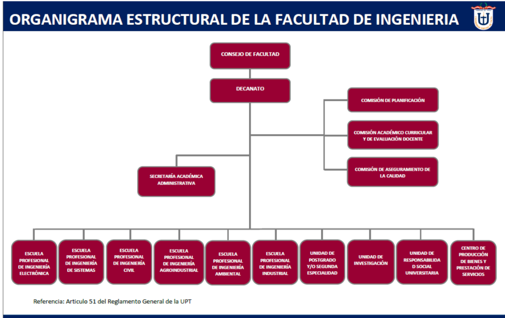

Gráfico 01: Esquema del organigrama de la Universidad Privada de Tacna.

## II. Visionamiento de la Empresa
#### 1. Descripción del Problema
<ul style="text-align: justify;">

En la actualidad, los estudiantes de la Escuela Profesional de Ingeniería de Sistemas de la Universidad Privada de Tacna (UPT) enfrentan diversos desafíos en la gestión de su rendimiento académico. Estos desafíos incluyen la falta de herramientas adecuadas para acceder a estadísticas detalladas sobre los cursos, la dificultad para tomar decisiones informadas basadas en datos claros y la ausencia de una plataforma centralizada para visualizar su progreso académico.

- **Falta de acceso a información académica personalizada:** La escuela dispone de un sistema administrativo que gestiona las estadísticas académicas a nivel institucional. Sin embargo, los estudiantes no tienen acceso directo a una plataforma que les permita visualizar de manera clara y personalizada datos como tasas de aprobación, índices de deserción y distribución de calificaciones en los cursos que les interesan. Esto limita su capacidad para evaluar y planificar su trayectoria académica de manera efectiva.

- **Dificultades para tomar decisiones informadas:** La carencia de herramientas accesibles y comprensibles para los estudiantes implica que deben tomar decisiones basadas en percepciones o información incompleta. Esta situación puede llevar a una planificación académica menos eficaz y a un rendimiento subóptimo en los cursos.

- **Impacto en el rendimiento académico:** Sin acceso a una visión detallada y precisa de su rendimiento académico, los estudiantes pueden enfrentar dificultades para identificar áreas de mejora y ajustar su enfoque de estudio, lo que afecta negativamente su desempeño y progreso académico.

- **Necesidad de una plataforma de visualización de datos:** Es fundamental desarrollar una herramienta analítica que permita a los estudiantes acceder a estadísticas relevantes y personalizadas sobre los cursos. Esta plataforma debería facilitar la toma de decisiones informadas, mejorar la planificación.

#### 2. Objetivos de Negocios

El objetivo principal de PAMIS es proporcionar una plataforma analítica que facilite la toma de decisiones académicas tanto para estudiantes como para el personal administrativo y docente. Los objetivos específicos de negocio incluyen:

- **Mejorar el acceso a información académica:** Permitir a los estudiantes visualizar datos personalizados sobre su rendimiento y progresión académica.

- **Optimizar la planificación académica:** Apoyar a los administradores en la identificación de patrones en la matrícula y rendimiento, permitiendo una asignación de recursos más eficiente.

- **Incrementar el rendimiento académico:** A través de un acceso simplificado a estadísticas de desempeño, ayudar a los estudiantes a identificar y enfocarse en áreas de mejora, reduciendo las tasas de deserción y aumentando las tasas de aprobación.

- **Fortalecer la calidad educativa:** Fomentar una cultura de toma de decisiones basada en datos que apoya el desarrollo continuo y la mejora de los programas de estudio.

#### 3. Objetivos de Diseño

Los objetivos de diseño de PAMIS se centran en crear una interfaz accesible y 	funcional que permita a los usuarios interactuar de manera intuitiva con los datos académicos. Estos objetivos incluyen:

- **Interactividad y facilidad de uso:** Diseñar un dashboard interactivo en Power BI que sea fácil de navegar para usuarios de diversos niveles técnicos.

- **Visualización de datos clara y precisa:** Implementar gráficos, tablas y reportes que permitan a los usuarios comprender rápidamente las estadísticas académicas.

- **Personalización:** Ofrecer opciones de filtrado y segmentación que permitan a los usuarios visualizar los datos según sus necesidades específicas (por ejemplo, por curso, semestre o año académico).

- **Accesibilidad y disponibilidad:** Garantizar que la plataforma esté disponible en entornos de escritorio y sea accesible en cualquier lugar con conexión a Internet.

- **Exportación de reportes:** Incluir funcionalidades que permitan la exportación de reportes en formatos accesibles (PDF, Excel) para el análisis y la consulta fuera de la plataforma.

#### 4. Alcance del proyecto

**Inclusiones:**

Desarrollo de una Aplicación en PowerBI:

- Creación de un dashboard interactivo en PowerBI que facilite la exploración visual de los datos académicos.

- Implementación de funcionalidades que permitan a los usuarios visualizar datos de matriculación, rendimiento académico y tasas de aprobación mediante gráficos dinámicos y tablas detalladas en PowerBI.

Funcionalidades Clave:

- Análisis detallado de los datos de matrículas, rendimiento académico y otros indicadores clave dentro del entorno de PowerBI.

- Exploración interactiva de los datos a través de visualizaciones en PowerBI para identificar patrones y tendencias que puedan guiar la toma de decisiones.

Soporte Tecnológico:

- Integración de capacidades avanzadas de análisis de datos y visualización en PowerBI para un rendimiento óptimo.

- Mantenimiento y actualizaciones continuas del dashboard en PowerBI, basadas en el feedback de los usuarios y las necesidades emergentes.

**Exclusiones:**
- Servicios Educativos Directos: PAMIS no proporcionará servicios educativos directos ni consultas académicas personalizadas.
- Gestión de Otros Programas Académicos: El enfoque estará limitado a la Ingeniería de Sistemas, y no se incluirá la gestión de otros programas académicos.
- Soporte Legal o Administrativo: La plataforma no ofrecerá asistencia legal ni soporte administrativo más allá del análisis de datos académicos.
- Soporte para Dispositivos Móviles: PAMIS no ofrecerá soporte ni optimización para dispositivos móviles, enfocándose únicamente en entornos de escritorio a través de PowerBI.

#### 5. Viabilidad del sistema

##### 5.1. Viabilidad Tecnica

**Hardware Disponible**

- **Equipos de desarrollo:** Se necesitan equipos de desarrollo capaces de ejecutar software de desarrollo web y herramientas de análisis de datos, los materiales previamente mencionados cumplen con las especificaciones mínimas requeridas:

   - **Procesador:** Intel Core i5 de 4 núcleos, útil para el manejo de tareas de programación, depuración y pruebas.

   - **Memoria RAM:** De 8 a 16 GB de memoria DDR4 expandible.

   - **Almacenamiento:** Disco duro sólido (SSD) para el sistema operativo, esto asegura tiempos de carga cada vez más cortos con un óptimo rendimiento general.

   - **Tarjeta Grafica:**Se usa la tarjeta gráfica integrada en el procesador Intel, pero también podemos hacer uso de una GPU dedicada como la Nvidia RTX 3050.

**Software**

- **Aplicaciones y Herramientas de Desarrollo:**

  - *Visual Studio Code:* Es el IDE principal para el desarrollo del proyecto, siendo compatible con los sistemas operativos Windows y macOS, ofreciendo extensiones que personalizan el entorno de trabajo.
  
  - *Terraform:* Utilizado para la creación y gestión automatizada de la infraestructura en Azure, asegurando consistencia y escalabilidad.

  - *Power BI:* Herramienta es para la creación de dashboards y visualizaciones de datos interactivos, además de ser poderosa para los análisis de datos.

  - *Azure SQL Database:* Base de datos transaccional utilizada para la gestión de datos académicos.

  
- **Navegadores Web:** La plataforma debe ser compatible con los navegadores web más conocidos y utilizados tales como Google Chrome, Mozilla Firefox, Microsoft Edge, etc.

**Infraestructura en la Nube**

- **Grupo de Recursos:** Contenedor lógico llamado inteligencia-negocios, que organiza todos los recursos relacionados en la ubicación East US.

- **Azure SQL Server:** Servidor principal para alojar la base de datos SQL, donde las credenciales son gestionadas de forma segura mediante Azure Key Vault. (Versión utilizada: SQL Server 12.0.)

- **Azure SQL Database:** Base de datos llamada CICLO_UNIVERSITARIO, con una capacidad de hasta 32 GB de almacenamiento, una capacidad minima de 0.5 vCores para ahorrar costos cuando está inactiva y cuenta con una auto-pausa que se activa tras 60 minutos de inactividad.

- **Terraform:** Infraestructura definida como código para garantizar consistencia y despliegue automatizado de recursos en Azure.

**Automatización**

La creación y el despliegue de los recursos en Azure se gestionan mediante Terraform, lo que asegura que los entornos de desarrollo, pruebas y producción se configuren de forma uniforme.

**Infraestructura de Red**

- **Conexión a Internet:** 
Una conexión a internet de alta velocidad es esencial para garantizar la disponibilidad y el acceso continuo a los servicios en la nube.

##### 5.2. Viabilidad Economica

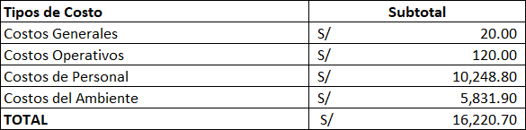

Tabla 01: En Costos Totales se resume los subtotales de los costos generales, de personal y del ambiente, llegando a un total acumulado de S/ 11,695.80

##### 5.3. Viabilidad Operativa

La viabilidad operativa del sistema PAMIS se basa en su capacidad para satisfacer las necesidades identificadas de los estudiantes, docentes y administradores de la Universidad Privada de Tacna (UPT), mejorando la toma de decisiones académicas y optimizando el acceso a datos relevantes. A continuación, se detallan los principales aspectos que confirman su viabilidad operativa:

- **Beneficios para los usuarios:**

   - **Estudiantes:** PAMIS permitirá a los estudiantes acceder a datos detallados sobre su rendimiento académico, como tasas de aprobación, índices de deserción y calificaciones. Esta información facilita una toma de decisiones más informada, ayudando a los estudiantes a planificar sus trayectorias académicas de manera eficiente y enfocarse en áreas donde necesitan mejorar.

   - **Docentes:** La plataforma ofrece a los docentes herramientas para analizar el rendimiento de sus estudiantes en cada curso. Esto les permite identificar áreas de dificultad común, ajustar sus métodos de enseñanza y brindar apoyo específico a estudiantes que lo requieran.

   - **Administradors:** Para los administradores, PAMIS centraliza la información académica y permite analizar tendencias de matrícula y rendimiento. Esto facilita la planificación académica, optimización de recursos, y toma de decisiones estratégicas para mejorar la calidad educativa en la Escuela Profesional de Ingeniería de Sistemas.

- **Reduccion de Carga Administrativa:** PAMIS ayuda a reducir la carga administrativa al centralizar el acceso a la información académica en un solo sistema. Los estudiantes y docentes ya no necesitan solicitar datos específicos a través de otros departamentos, ya que la plataforma ofrece una vista completa y en tiempo real de las estadísticas académicas necesarias. Esto mejora la eficiencia operativa, liberando tiempo y recursos para otras actividades en la institución.

- **Facilidad de Uso:** La plataforma PAMIS está diseñada para ser intuitiva y de fácil acceso, utilizando Power BI como base, el sistema ofrece una interfaz interactiva con dashboards y visualizaciones gráficas que permiten a los usuarios explorar los datos sin necesidad de conocimientos técnicos avanzados. Esto asegura que tanto estudiantes como docentes y administradores puedan utilizar la plataforma sin dificultades, incrementando la satisfacción y el valor percibido del sistema.

- **Compatibilidad con las Politicas Institucionales:** PAMIS cumple con las políticas y regulaciones internas de la UPT en cuanto al manejo de datos académicos y privacidad de la información. Además, sigue la normativa de la Ley de Protección de Datos Personales en Perú, garantizando la seguridad y confidencialidad de los datos personales de los estudiantes. Esto refuerza la viabilidad operativa de la plataforma, asegurando su aceptación y cumplimiento dentro de la institución.

Estos factores confirman que PAMIS es operativamente viable, ya que proporciona beneficios tangibles a sus usuarios, reducir cargas administrativas y es fácil de usar, cumpliendo además con las regulaciones internas y externas de la UPT y asegurando la escalabilidad del sistema a largo plazo.

#### 6. Informacion obtenida del levantamiento de informacion

Durante el levantamiento de información para el desarrollo de PAMIS, se identificaron los siguientes aspectos clave:

   - **Necesidades de los estudiantes:** Los estudiantes de Ingeniería de Sistemas manifestaron la necesidad de contar con una plataforma centralizada que les permita acceder a estadísticas detalladas de su rendimiento académico. Actualmente, la falta de una herramienta de visualización dificulta el seguimiento de su progreso y la identificación de áreas de mejora, lo cual impacta en su planificación académica y rendimiento general.

   - **Requerimientos de los Docentes y Administradores:** Los docentes necesitan herramientas para monitorear el progreso de sus estudiantes y adaptar sus métodos de enseñanza según el rendimiento de cada curso. Asimismo, los administradores buscan optimizar la asignación de recursos mediante el análisis de tendencias de matrícula, tasas de aprobación y áreas críticas en el rendimiento estudiantil.

La información obtenida durante el levantamiento confirma la necesidad y viabilidad de PAMIS como una solución para centralizar y optimizar el acceso a datos académicos, beneficiando tanto a estudiantes como al cuerpo docente y administrativo de la UPT.

</ul>

## III. Análisis de Procesos

- Diagrama del Proceso Actual - Diagrama de actividades

<ul style="text-align: justify;">
   "El sistema actual no cuenta con un flujo definido para gestionar estadísticas académicas. PAMIS viene a estructurar y optimizar este proceso."
</ul>

- Diagrama del Proceso Propuesto - Diagrama de actividades Inicial

<ul style="text-align: justify;">

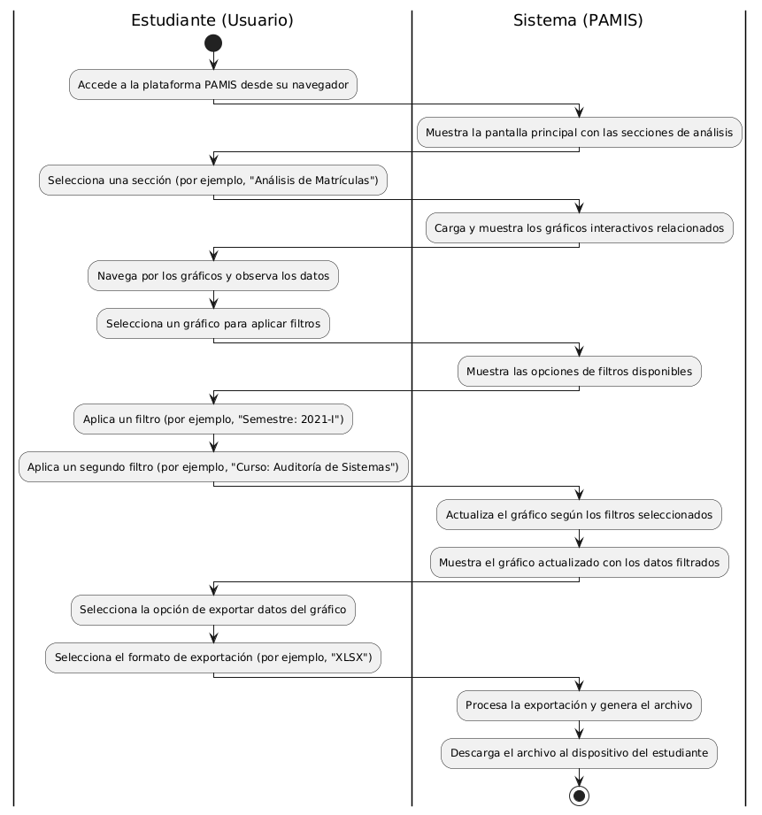
</ul>

<ul style="text-align: justify;">
Diagrama 01: El diagrama muestra cómo el estudiante interactúa con PAMIS para navegar, aplicar filtros a gráficos y exportar datos, mientras el sistema actualiza y genera los resultados solicitados.
</ul>

## IV. Especificación de Requerimientos de Software
#### a. Cuadro de Requerimientos No Funcionales

| **Código** | **Requerimiento**                        | **Descripción**                                                                                                                                              |
|------------|------------------------------------------|--------------------------------------------------------------------------------------------------------------------------------------------------------------|
| RF-01      | Usabilidad                               | La interfaz de usuario debe ser intuitiva y accesible, permitiendo que usuarios con distintos niveles de experiencia técnica puedan navegar, visualizar datos y generar reportes sin dificultades. |
| RF-02      | Disponibilidad y Fiabilidad              | La plataforma debe estar disponible el 99.5% del tiempo, excluyendo períodos de mantenimiento programado.                                                     |
| RF-03      | Seguridad de Datos                       | La plataforma debe cumplir con la Ley de Protección de Datos Personales en Perú, asegurando la confidencialidad y privacidad de los datos académicos y personales de los estudiantes. |
| RF-04      | Compatibilidad                           | La plataforma debe ser accesible desde entornos de escritorio, funcionando en sistemas operativos Windows y macOS, y ser compatible con los navegadores más utilizados (Google Chrome, Mozilla Firefox, Microsoft Edge). |
| RF-05      | Recuperación Rápida ante Fallos e Interrupciones | La plataforma debe recuperarse de manera muy rápida frente a fallos e interrupciones.                                                                          |
| RF-06      | Interactividad y Visualización de Datos  | La plataforma debe permitir una visualización precisa y flexible, con filtros personalizables y segmentación de datos aplicable en un 95% de las consultas realizadas. |

 

#### b. Cuadro de Requerimientos Funcionales

| **Código** | **Requerimiento**                        | **Descripción**                                                                                                                                              |
|------------|------------------------------------------|--------------------------------------------------------------------------------------------------------------------------------------------------------------|
| RF-01      | Dashboard Interactivo                               | La plataforma debe proporcionar un dashboard interactivo en Power BI que permita a los usuarios (estudiantes, docentes y administradores) acceder a estadísticas detalladas de matrícula, rendimiento académico y otros indicadores clave. |
| RF-02      | Visualización de Estadísticas Académicas              | La plataforma debe mostrar datos sobre tasas de aprobación, índices de deserción, calificaciones máximas y mínimas, y rendimiento por curso. Los usuarios deben poder visualizar estos datos mediante gráficos, tablas y reportes que faciliten la comprensión de la información. |
| RF-03      | Análisis Comparativo                       | La plataforma debe permitir comparaciones de rendimiento académico entre diferentes cohortes de estudiantes para identificar tendencias y patrones a lo largo del tiempo. |
| RF-04      | Identificacion de Areas Criticas                           | La plataforma debe identificar y destacar los cursos o áreas académicas con altos índices de desaprobación, ayudando a la administración y a los docentes a implementar estrategias de mejora. |
| RF-05      | Exportación de Reportes | La plataforma debe incluir funcionalidades para que los usuarios puedan exportar reportes en formatos PDF y Excel, permitiendo un análisis posterior fuera de la plataforma. |
| RF-06      | Filtros y Segmentación  | La plataforma debe permitir que los usuarios apliquen filtros y segmentan los datos en función de criterios específicos, como curso, semestre, año académico y docente. |
| RF-07      | Generación de Recomendaciones Académicas  | La plataforma debe ofrecer recomendaciones y análisis predictivos basados en datos históricos, apoyando a los estudiantes en la toma de decisiones informadas sobre su trayectoria académica. |

 

#### c. Reglas de Negocio

| **Código** | **Requerimiento**                        | **Descripción**                                                                                                                                              |
|------------|------------------------------------------|--------------------------------------------------------------------------------------------------------------------------------------------------------------|
| Proteccion de Datos Personales      | PAMIS cumple con la Ley de Protección de Datos Personales de Perú, asegurando la confidencialidad de los datos de los estudiantes mediante encriptación y autenticación de usuarios. | UPT |
| Frecuencia de Actualización de Datos | Los datos académicos deben actualizarse al final de cada ciclo académico o en fechas específicas establecidas por la UPT para reflejar información precisa. | UPT |
| Normativa de Exportación de Datos | Los reportes exportados deben incluir una nota de confidencialidad. Estudiantes y docentes pueden exportar datos propios; administradores, datos agregados. | UPT |
| Criterios para Identificación de Áreas Críticas | Un curso es considerado "área crítica" si tiene una tasa de desaprobación superior al 30% o una caída en el rendimiento en tres ciclos consecutivos. | UPT |
| Política de Personalización y Filtros de Datos | Estudiantes y docentes pueden aplicar filtros para analizar datos, pero no pueden alterar ni comparar datos personales sin autorización. | UPT |
| Política de Mantenimiento y Actualización | Las actualizaciones del sistema deben realizarse fuera de horario académico y estar aprobadas por la administración de la UPT.  | UPT |

## V. Fases de Desarrollo
#### 1. Perfiles de Usuario

<ul style="text-align: justify;">
    <li><strong>Administradores:</strong>

    Es el responsable de supervisar y gestionar toda la información del sistema. Tiene acceso completo para actualizar datos académicos, generar reportes completos y brindar soporte técnico. Además, se encarga del mantenimiento del sistema y de asegurar su correcto funcionamiento. Requiere conocimientos técnicos en herramientas como Power BI y habilidades para manejar datos y resolver problemas del sistema.
    

 </li>
    <li><strong>Estudiantes:</strong>

    Es el usuario final que interactúa con la plataforma para consultar datos académicos agregados y segmentados. Puede explorar estadísticas generales de la población estudiantil, como tasas de aprobación o índices de deserción, pero no puede acceder a información específica de otros estudiantes ni visualizar su propio rendimiento. Este perfil está diseñado para analizar tendencias académicas globales y no personalizadas.
    

 </li>
</ul>

#### 2. Modelo Conceptual

### a) Diagrama de Paquetes

**Diagrama de Paquetes de PAMIS**

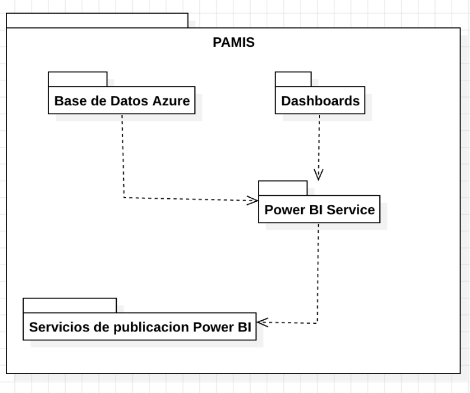

Diagrama 02: El diagrama representa la estructura de PAMIS, donde los Dashboards interactúan con los usuarios y son gestionados a través del Power BI Service, que recibe reportes publicados desde los Servicios de Publicación de Power BI. La Base de Datos provee la información que alimenta los gráficos, asegurando un flujo eficiente entre datos, procesamiento y visualización.

---

### b) Diagrama de Casos de Uso

**Diagrama de Casos de Uso de la Plataforma en PowerBi**  

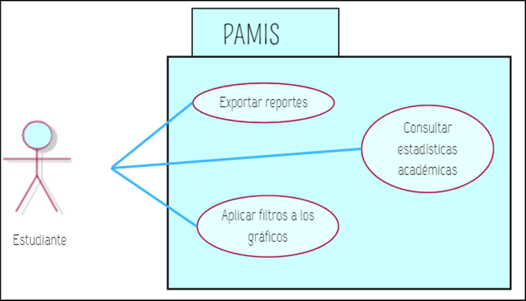

Diagrama 03: El diagrama muestra cómo el Estudiante interactúa con el sistema PAMIS para Consultar estadísticas académicas, Aplicar filtros y Exportar reportes, destacando las principales funcionalidades disponibles para el usuario.

## c) Escenarios de Caso de Uso (narrativa)

### Narrativa de CU01: “Consultar estadísticas académicas”

| **Caso de Uso**            | Consultar estadísticas académicas (CU01)                                        |
|-----------------------------|---------------------------------------------------------------------------------|
| **Actores**                | Estudiante                                                                      |
| **Descripción**            | Permitir a los estudiantes acceder directamente a la plataforma PAMIS y explorar diferentes secciones de análisis, cada una con gráficos interactivos que muestran información específica, como estadísticas de matrículas, desempeño académico, comparaciones entre cohortes e identificación de áreas críticas. |
| **Precondiciones**         | El estudiante debe tener acceso a un dispositivo con conexión a la plataforma PAMIS. |
| **Flujo Normal**           |                                                                                 |
| **Acción del Actor**       | **Curso del Sistema**                                                           |
| 1. Accede a la plataforma PAMIS desde su navegador. | 2. Muestra la pantalla principal con las secciones disponibles: Análisis de Matrículas, Desempeño Académico, Análisis Comparativo e Identificación de Áreas Críticas. |
| 3. Selecciona una sección, como "Análisis de Matrículas". | 4. Carga y muestra los gráficos relacionados con las estadísticas de matrículas. |
| 5. Navega por los gráficos y observa los datos mostrados. | 6. Permite interactuar con los gráficos, mostrando detalles específicos al pasar el cursor o hacer clic. |

---

### Narrativa de CU02: “Aplicar filtros a los gráficos”

| **Caso de Uso**            | Aplicar filtros a los gráficos (CU02)                                           |
|-----------------------------|---------------------------------------------------------------------------------|
| **Actores**                | Estudiante                                                                      |
| **Descripción**            | Permitir a los estudiantes personalizar los datos mostrados en los gráficos interactivos aplicando filtros específicos, como selección de semestres, cursos o indicadores académicos. |
| **Precondiciones**         | El estudiante debe estar visualizando un gráfico en cualquiera de las secciones disponibles en la plataforma PAMIS. |
| **Flujo Normal**           |                                                                                 |
| **Acción del Actor**       | **Curso del Sistema**                                                           |
| 1. Selecciona un gráfico dentro de una sección de análisis. | 2. Muestra el gráfico con los datos generales y las opciones de filtros disponibles. |
| 3. Elige un filtro, como "Semestre: 2021-I". | 4. Actualiza el gráfico para reflejar los datos correspondientes al semestre seleccionado. |
| 5. Selecciona un segundo filtro, como "Curso: Auditoría de Sistemas". | 6. Combina ambos filtros y actualiza el gráfico de manera interactiva. |

---

### Narrativa de CU03: “Exportar reportes”

| **Caso de Uso**            | Exportar reportes (CU03)                                                        |
|-----------------------------|---------------------------------------------------------------------------------|
| **Actores**                | Estudiante                                                                      |
| **Descripción**            | Permitir a los estudiantes exportar los reportes generados en la plataforma PAMIS en formatos XLSX o CSV, para su análisis y uso externo. |
| **Precondiciones**         | El estudiante debe estar visualizando un gráfico o reporte en cualquier sección de la plataforma PAMIS. |
| **Flujo Normal**           |                                                                                 |
| **Acción del Actor**       | **Curso del Sistema**                                                           |
| 1. Selecciona un gráfico dentro de una sección. | 2. Muestra el gráfico con la opción "Exportar datos". |
| 3. Hace clic en la opción "Exportar datos". | 4. Muestra un cuadro de diálogo con las opciones de exportación: "Datos resumidos" o "Datos con diseño actual" (si aplicable). |
| 5. Selecciona "Datos resumidos". | 6. Habilita los formatos disponibles para exportar: XLSX y CSV. |
| 7. Elige un formato, como "XLSX". | 8. Procesa la exportación y genera el archivo en el formato seleccionado. |
| 9. Hace clic en el botón de descarga. | 10. Descarga el archivo al dispositivo del estudiante. |

#### 3. Modelo Lógico

### a) Análisis de Objetos

### Objetos Entidad  

Gráfico 02: Objetos entidad en el sistema PAMIS.

### Objetos Frontera 

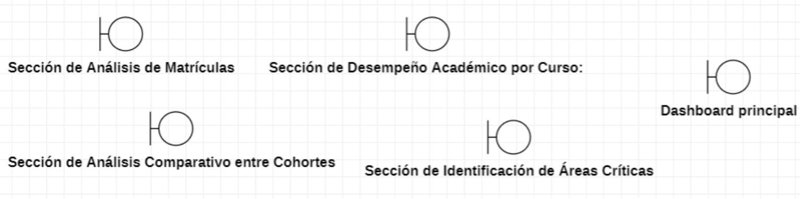

Gráfico 03: Objetos frontera en el sistema PAMIS.

### Objetos Control 

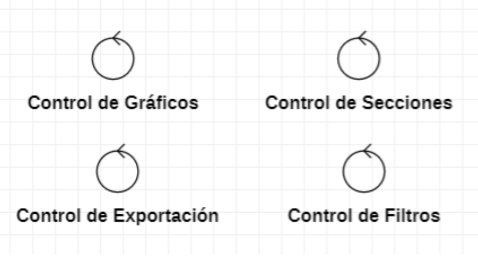

Gráfico 04: Objetos control en el sistema PAMIS.

---

### b) Diagrama de Actividades con Objetos

### Diagrama de Actividades CU01: "Consultar estadísticas académicas"  

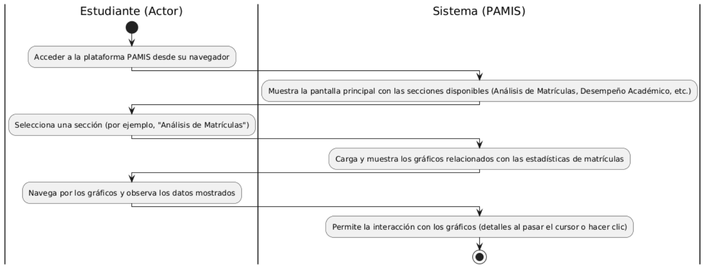  

Diagrama 04: El diagrama muestra el proceso de interacción entre el estudiante y el sistema PAMIS para consultar estadísticas académicas. El estudiante accede a la plataforma, selecciona una sección de análisis, como "Análisis de Matrículas", y navega por los gráficos. El sistema responde mostrando las opciones disponibles, cargando los gráficos y permitiendo la interacción con los datos de manera dinámica.

---

### Diagrama de Actividades CU02: "Aplicar filtros a los gráficos"  

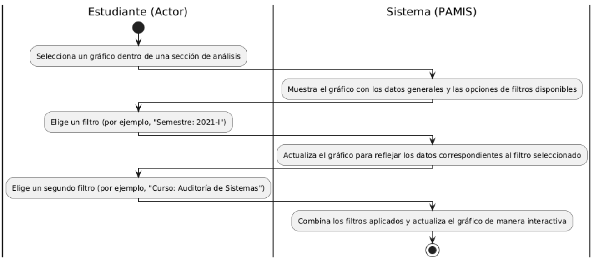  

Diagrama 05: Este diagrama de actividades representa el proceso para aplicar filtros a los gráficos en la plataforma PAMIS. Donde el estudiante aplica un filtro inicial, como un semestre específico, y el sistema actualiza el gráfico para reflejar los datos correspondientes. Posteriormente, el estudiante agrega un segundo filtro, como un curso en particular, y el sistema combina ambos filtros y actualiza el gráfico de forma interactiva, completando el flujo.

---

### Diagrama de Actividades CU03: "Exportar reportes"  

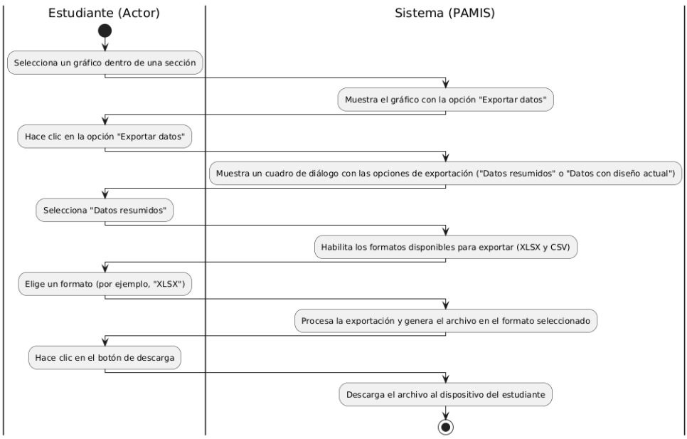 

Diagrama 06: El diagrama muestra cómo el estudiante exporta reportes en PAMIS. Selecciona un gráfico, elige "Exportar datos", define el tipo de datos y el formato (por ejemplo, XLSX). El sistema genera el archivo y lo descarga al dispositivo del estudiante.

---

#### c) Diagrama de Secuencia

### Diagrama de Secuencia de CU01: "Consultar estadísticas académicas"  

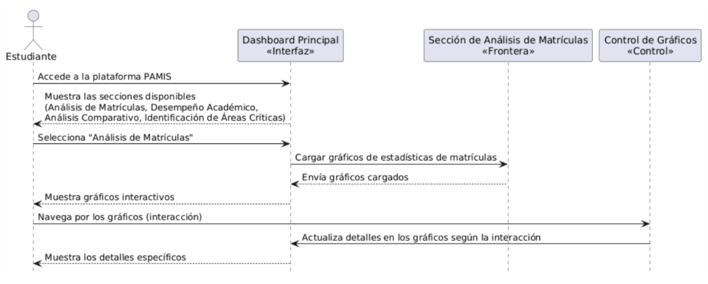  

Diagrama 07: El diagrama muestra cómo el estudiante accede, selecciona una sección y navega por gráficos que se actualizan dinámicamente.

---

### Diagrama de Secuencia de CU02: "Aplicar filtros a los gráficos"  

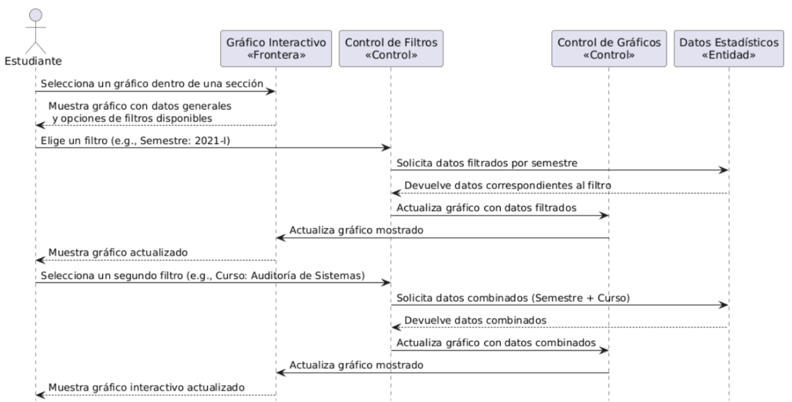 

Diagrama 08: El diagrama muestra cómo el estudiante aplica filtros a un gráfico, y el sistema actualiza los datos dinámicamente mediante los controles de filtros y gráficos.

---

### Diagrama de Secuencia de CU03: "Exportar reportes"  

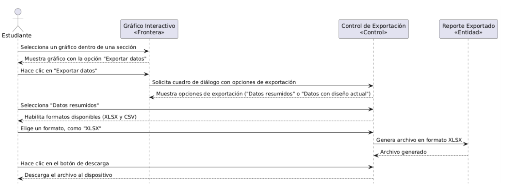  

Diagrama 09: El diagrama muestra cómo el estudiante exporta un gráfico en formato XLSX o CSV, y el sistema genera y descarga el archivo.

---

#### d) Diagrama de Clases  

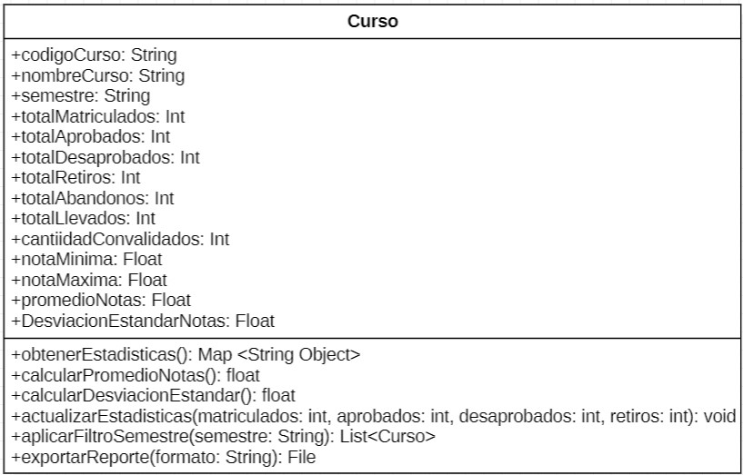  

Diagrama 10: Este diagrama muestra los datos del dashboard de PowerBi, donde se muestran las diferentes relaciones entre las tablas.

## Conclusiones

+ PAMIS permite centralizar y optimizar el análisis académico mediante herramientas interactivas que mejoran la toma de decisiones de estudiantes, docentes y administradores.
+ La plataforma resuelve la falta de acceso a estadísticas académicas detalladas, proporcionando gráficos dinámicos y opciones de filtrado que facilitan la exploración de datos relevantes.
+ La integración de Power BI garantiza una experiencia de usuario intuitiva y accesible, reduciendo la carga administrativa y aumentando la eficiencia en la planificación académica.

## Recomendaciones
+ Ampliar el alcance de PAMIS para incluir otras carreras profesionales, potenciando su utilidad en toda la universidad.
+ Incorporar soporte para dispositivos móviles para aumentar la accesibilidad de la plataforma.
+ Realizar actualizaciones continuas basadas en el feedback de los usuarios para mejorar la experiencia y funcionalidad del sistema.
+ Implementar funcionalidades predictivas basadas en inteligencia artificial para proporcionar recomendaciones personalizadas a los estudiantes.
