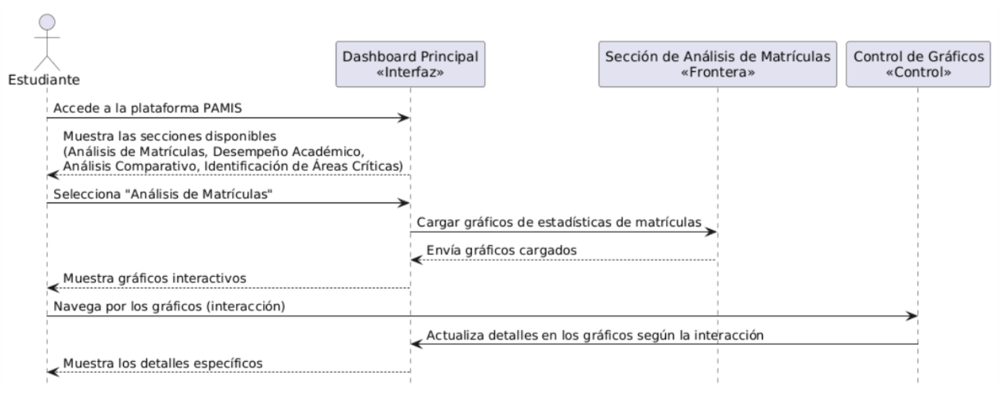
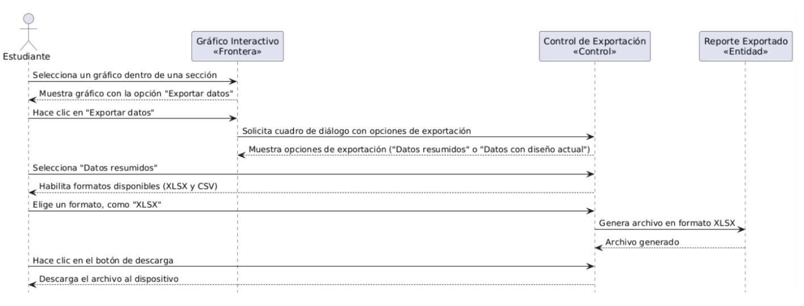
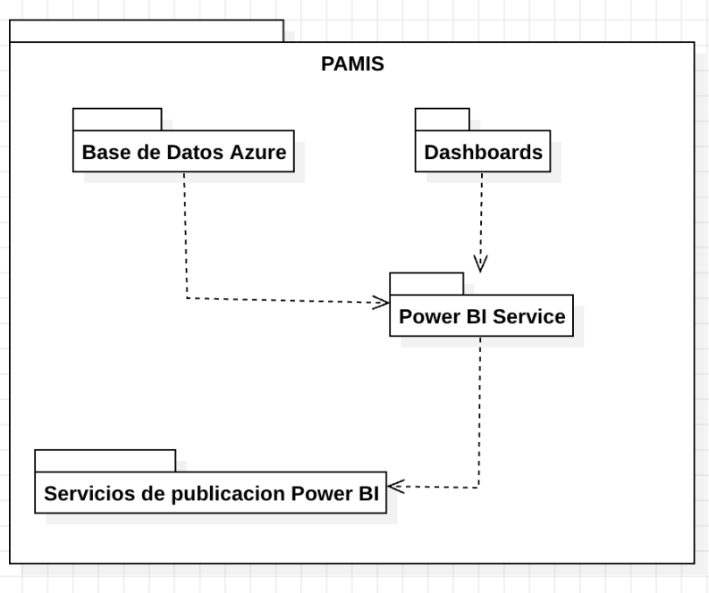

# UNIVERSIDAD PRIVADA DE TACNA  
## FACULTAD DE INGENIERÍA  
### Escuela Profesional de Ingeniería de Sistemas

**Plataforma de análisis de datos de matriculados en la carrera de Ingeniería de Sistemas para la Universidad Privada de Tacna - PAMIS**

Curso: *Inteligencia de Negocios*  
Docente: *Mag. Patrick Cuadros Quiroga*

**Integrantes:**

Agreda Ramirez, Jesus Eduardo  &emsp;&emsp;&emsp;&emsp;- &emsp;  (2021069823)
 Castañeda Centurion, Jorge Enrique &emsp; - &emsp; (2021069822)
 Contreras Lipa Alvaro Javier &emsp;&emsp;&emsp;&emsp;&emsp;&ensp; - &emsp;  (2021070020)
 Malaga Espinoza, Ivan Francisco &emsp;&emsp;&ensp; - &emsp; (2021071086)
 Ortiz Fernandez, Ximena Andrea &emsp;&emsp;&ensp; - &emsp;  (2021071080)

**Tacna – Perú**  
***2024***

\pagebreak

# **Documento de Arquitectura de Software**

**Plataforma de análisis de datos de matriculados en la carrera de Ingeniería de Sistemas para la Universidad Privada de Tacna - PAMIS**

**Versión 1.0**

## **Control de Versiones**

| Versión | Hecha por | Revisada por | Aprobada por | Fecha      | Motivo           |
| :-----: | --------- | ------------ | ------------ | ---------- | ---------------- |
| 1.0     | JCC       | IME          | ACL          | 15/11/2024 | Versión Original |

\pagebreak

## **Índice General**

1. [Introducción](#1)  
   1.1. Propósito  
   1.2. Alcance  
   1.3. Definiciones, Siglas y Abreviaturas  
   1.4. Visión General  

2. [Representación Arquitectónica](#2)  
   2.1. Escenarios  
   2.2. Vista Lógica  
   2.3. Vista del Proceso  
   2.4. Vista de Desarrollo  
   2.5. Vista Física  

3. [Objetivos y Limitaciones Arquitectónicas](#3)  
   3.1. Disponibilidad  
   3.2. Seguridad  
   3.3. Adaptabilidad  
   3.4. Rendimiento  

4. [Análisis de Requerimientos](#4)  
   4.1. Requerimientos Funcionales  
   4.2. Requerimientos No Funcionales  

5. [Vistas de Caso de Uso](#5)  

6. [Vista Lógica](#6)  
   6.1. Diagrama Contextual  

7. [Vista de Procesos](#7)  
   7.1. Diagrama de Proceso Actual  
   7.2. Diagrama de Proceso Propuesto  

8. [Vista de Despliegue](#8)  
   8.1. Diagrama de Contenedor  

9. [Vista de Implementación](#9)  
   9.1. Diagrama de Componentes  

10. [Vista de Datos](#10)  
    10.1. Diagrama Entidad Relación  

11. [Calidad](#11)  
    11.1. Escenario de Seguridad  
    11.2. Escenario de Usabilidad  
    11.3. Escenario de Adaptabilidad  
    11.4. Escenario de Disponibilidad  
    11.5. Otro Escenario  

\pagebreak

# **Documento de Arquitectura de Software**

<h2 id="1">1. Introducción </h2>

    El presente Documento de Arquitectura de Software para PAMIS (Plataforma de Análisis de Matriculados en Ingeniería de Sistemas) tiene como objetivo principal proporcionar una visión clara sobre las tasas de matriculación y su evolución a lo largo del tiempo para identificar tendencias y patrones de inscripción. PAMIS no es solo una plataforma tecnológica; es una iniciativa estratégica diseñada para abordar varios desafíos en la gestión de su rendimiento académico de los estudiantes de la Escuela Profesional de Ingeniería de Sistemas. 

    Este documento se centra en ofrecer una guía clara y comprensible para todos los desarrolladores y partes interesadas, detallando la organización del proyecto, los datos y gráficos involucrados, así como las interacciones dinámicas entre ellos. Se incluyen diagramas que especifican los métodos y procesos críticos del sistema, asegurando que cada elemento del sistema esté bien documentado y sea fácil de entender.

    A lo largo del documento, se abordarán los siguientes puntos clave: la estructura del proyecto, incluyendo la organización de los gráficos y sus relaciones con los datos proporcionados, detallando los principales elementos del sistema, su propósito y cómo interactúan entre sí; mostrando un listado de las herramientas utilizadas, y el entorno en el que se construye y despliega el sistema; y diagramas detallados, incluyendo diagramas de secuencia y otros diagramas UML que ilustran las interacciones entre los datos y sus respectivos gráficos, especificando los métodos y flujos de datos más importantes.

    Con una visión comprensiva de PAMIS y su arquitectura, este documento simplifica la colaboración y el entendimiento entre todos los miembros del equipo de desarrollo. El objetivo es asegurar que el proyecto se implemente de manera efectiva y eficiente, cumpliendo con todos los requisitos y objetivos establecidos, y ofreciendo una plataforma robusta y fácil de usar para los estudiantes.

### 1.1 Propósito

PAMIS busca ofrecer una plataforma de tecnología que otorgue a los estudiantes la oportunidad de abordar los desafíos relacionados con el análisis de su desempeño académico. Estos desafíos incluyen la falta de herramientas adecuadas para acceder a estadísticas detalladas sobre los cursos, la dificultad para tomar decisiones informadas basadas en datos claros y la ausencia de una plataforma centralizada para visualizar su progreso académico. Pero no son solo estos desafíos, sino que PAMIS también busca proporcionar mejoras y optimizaciones, tales como:

- <u><b>Facilitar el Análisis Académico:</b></u> Proporcionar una plataforma que permita a los usuarios analizar datos de matriculación y rendimiento académico de manera eficiente, identificando tendencias y patrones clave.

- <u><b>Mejorar la Toma de Decisiones:</b></u> Ofrecer informes y recomendaciones basados en análisis estadísticos que guíen la toma de decisiones estratégicas para los estudiantes.

- <u><b>Optimizar los Resultados Educativos:</b></u> A través del análisis de datos y la identificación de áreas de mejora, ayudar a la institución a implementar estrategias que optimicen el rendimiento académico y aumenten las tasas de aprobación.

### 1.2 Alcance

<u>Inclusiones:</u>
- **Desarrollo de una Aplicación en PowerBI:**
  - Creación de un dashboard interactivo en PowerBI que facilite la exploración visual de los datos académicos.
  - Implementación de funcionalidades que permitan a los usuarios visualizar datos de matriculación, rendimiento académico y tasas de aprobación mediante gráficos dinámicos y tablas detalladas en PowerBI.
- **Funcionalidades Clave:**
  - Análisis detallado de los datos de matrículas, rendimiento académico y otros indicadores clave dentro del entorno de PowerBI.
  - Generación de informes automatizados y personalizados con recomendaciones basadas en análisis estadísticos, accesibles directamente en PowerBI.
  - Exploración interactiva de los datos a través de visualizaciones en PowerBI para identificar patrones y tendencias que puedan guiar la toma de decisiones.
- **Soporte Tecnológico:**
  - Integración de capacidades avanzadas de análisis de datos y visualización en PowerBI para un rendimiento óptimo.
  - Mantenimiento y actualizaciones continuas del dashboard en PowerBI, basadas en el feedback de los usuarios y las necesidades emergentes.
  
<u>Exclusiones:</u>
- **Servicios Educativos Directos:** PAMIS no proporcionará servicios educativos directos ni consultas académicas personalizadas.
- **Gestión de Otros Programas Académicos:** El enfoque estará limitado a la Ingeniería de Sistemas, y no se incluirá la gestión de otros programas académicos.
- **Soporte Legal o Administrativo:** La plataforma no ofrecerá asistencia legal ni soporte administrativo más allá del análisis de datos académicos.
- **Soporte para Dispositivos Móviles:** PAMIS no ofrecerá soporte ni optimización para dispositivos móviles, enfocándose únicamente en entornos de escritorio a través de PowerBI.

### 1.3 Definiciones, Siglas y Abreviaturas
- **PAMIS:** Plataforma de Análisis de Matriculados en Ingeniería de Sistemas.
- **UPT:** Universidad Privada de Tacna.
- **EPIS:** Escuela profesional de ingeniería de sistemas.
- **Análisis de datos:** Proceso de recopilación, limpieza, transformación y modelado de datos con el objetivo de descubrir patrones, tendencias y relaciones significativas.
- **Interfaz de usuario:** Conjunto de elementos visuales y controles que permiten a un usuario interactuar con un software o aplicación. 

### 1.4 Visión General

El proyecto PAMIS (Plataforma de Análisis de Matriculados en Ingeniería de Sistemas) tiene como objetivo principal desarrollar una herramienta analítica que permita a los estudiantes y docentes de la Escuela Profesional de Ingeniería de Sistemas de la Universidad Privada de Tacna obtener una comprensión profunda del desempeño académico de los alumnos que la conforman. Esta plataforma proporcionará un análisis detallado de datos de matrículas, rendimiento académico, tasas de aprobación y otros indicadores clave, facilitando la identificación de patrones y tendencias que puedan guiar la toma de decisiones estratégicas para mejorar la calidad y desempeño educativo de los estudiantes.

PAMIS está diseñada para ser una herramienta intuitiva y de fácil acceso, con una interfaz visual que permite a los usuarios explorar los datos de manera interactiva. La plataforma no solo permitirá la visualización clara de estos datos mediante gráficos y tablas, sino que también generará informes que ofrecerán recomendaciones basadas en análisis estadísticos. Estos informes ayudarán a los estudiantes a tomar decisiones informadas sobre el proceso educativo, optimizando los resultados académicos y contribuyendo al éxito general de los programas de ingeniería.

## 2. Representación Arquitectónica 

### 2.1. Escenarios
<ul style="text-align: justify;">

Diagrama de Casos de Uso de la plataforma en PowerBi

Diagrama 01: El diagrama muestra cómo el Estudiante interactúa con el sistema PAMIS para Consultar estadísticas académicas, Aplicar filtros y Exportar reportes, destacando las principales funcionalidades disponibles para el usuario.

### 2.2. Vista Logica

Componentes del Sistema de Análisis Académico en Power BI PAMIS

Diagrama 02: Este diagrama proporciona una vista más detallada de los componentes del proyecto, facilitando la comprensión de su estructura y organización.

### 2.3. Vista del Proceso

**Diagrama de Secuencia de CU01 "Consultar Estadisticas academicas"**

Diagrama 03: El diagrama muestra cómo el estudiante accede, selecciona una sección y navega por gráficos que se actualizan dinámicamente.

**Diagrama de Secuencia de CU02 “Exportar reportes”**

Diagrama 04: El diagrama muestra cómo el estudiante aplica filtros a un gráfico, y el sistema actualiza los datos dinámicamente mediante los controles de filtros y gráficos.

**Diagrama de Secuencia de CU03 “Aplicar filtros a los gráficos”**

Diagrama 05: El diagrama muestra cómo el estudiante exporta un gráfico en formato XLSX o CSV, y el sistema genera y descarga el archivo.

### 2.4. Vista de desarrollo

Diagrama de paquetes

Diagrama 06: El diagrama representa la estructura de PAMIS, donde los Dashboards interactúan con los usuarios y son gestionados a través del Power BI Service, que recibe reportes publicados desde los Servicios de Publicación de Power BI. La Base de Datos provee la información que alimenta los gráficos, asegurando un flujo eficiente entre datos, procesamiento y visualización.La Base de Datos provee la información que alimenta los gráficos, asegurando un flujo eficiente entre datos, procesamiento y visualización.

### 2.5. Vista Fisica

Diagrama de clases

Diagrama 07: Este diagrama muestra la entidad Curso con sus atributos correspondientes y métodos para el cálculo estadístico de las notas

</ul>

## 3. Objetivos y Limitaciones Arquitectónicas 
### 3.1 Disponibilidad
- Alta Disponibilidad: Implementar mecanismos de redundancia y recuperación ante fallos para asegurar que la plataforma esté disponible en todo momento.
- Monitoreo y Alertas: Utilizar herramientas de monitoreo para detectar y solucionar problemas antes de que afecten a los usuarios.
- Escalabilidad Horizontal: Con un aumento repentino de usuarios, se puede optar por añadir varias instancias de PAMIS.

### 3.2 Seguridad
- Autenticación y Autorización: Implementar controles de acceso basados en roles para asegurar que solo usuarios autorizados puedan acceder a ciertos niveles de información.
- Encriptación de Datos: Implementar la encriptación de datos en tránsito y en reposo para proteger la información sensible.
- Monitoreo de Seguridad: Realizar monitoreos constantes para detectar y mitigar posibles amenazas de seguridad.
- Cumplimiento Normativo: Asegurarse de que la plataforma cumpla con las normativas y regulaciones vigentes en materia de protección de datos y privacidad.

### 3.3 Adaptabilidad
- Arquitectura Modular: Diseñar el sistema con una arquitectura modular para permitir la fácil adición, eliminación o modificación de componentes sin afectar al resto del sistema.
- Soporte Multiplataforma: Asegurar que la plataforma funcione correctamente en diversos dispositivos y navegadores.
- Configurabilidad: Permitir que los administradores configuren ciertos aspectos del sistema sin necesidad de cambios en el código.

### 3.4 Rendimiento
- Optimización de consultas: Optimizar las consultas y modelos de datos con el propósito de que las visualizaciones se generen en tiempo real sin demora alguna.
- Tiempos de carga: Minimizar de tiempos de carga en el dashboard interactivo, asegurando una experiencia de usuario fluida.
- Caching: Uso de técnicas de cacheo y optimización del modelo de datos para reducir la carga en el servidor durante picos de uso.
- Balanceo de Carga: Utilizar balanceadores de carga para distribuir el tráfico entre varios servidores y asegurar un rendimiento óptimo.

## 4. Análisis de Requerimientos 
### 4.1 Requerimientos funcionales
| **Código** | **Requerimiento**                     | **Descripción**                                                                                                                                                                                                                  |
|------------|---------------------------------------|----------------------------------------------------------------------------------------------------------------------------------------------------------------------------------------------------------------------------------|
| RF-01      | Dashboard Interactivo                | La plataforma debe proporcionar un dashboard interactivo en Power BI que permita a los usuarios (estudiantes, docentes y administradores) acceder a estadísticas detalladas de matrícula, rendimiento académico y otros indicadores clave. |
| RF-02      | Visualización de Estadísticas Académicas | La plataforma debe mostrar datos sobre tasas de aprobación, índices de deserción, calificaciones máximas y mínimas, y rendimiento por curso. Los usuarios deben poder visualizar estos datos mediante gráficos, tablas y reportes que faciliten la comprensión de la información. |
| RF-03      | Análisis Comparativo                 | La plataforma debe permitir comparaciones de rendimiento académico entre diferentes cohortes de estudiantes para identificar tendencias y patrones a lo largo del tiempo.                                                          |
| RF-04      | Identificación de Áreas Críticas     | La plataforma debe identificar y destacar los cursos o áreas académicas con altos índices de desaprobación, ayudando a la administración y a los docentes a implementar estrategias de mejora.                                     |
| RF-05      | Exportación de Reportes             | La plataforma debe incluir funcionalidades para que los usuarios puedan exportar reportes en formatos PDF y Excel, permitiendo un análisis posterior fuera de la plataforma.                                                       |
| RF-06      | Filtros y Segmentación              | La plataforma debe permitir que los usuarios apliquen filtros y segmenten los datos en función de criterios específicos, como curso, semestre, año académico y docente.                                                            |
| RF-07      | Generación de Recomendaciones Académicas | La plataforma debe ofrecer recomendaciones y análisis predictivos basados en datos históricos, apoyando a los estudiantes en la toma de decisiones informadas sobre su trayectoria académica.                                      |

### 4.2 Requerimientos no funcionales

| **Código** | **Requerimiento**                  | **Descripción**                                                                                                                                                                              |
|------------|------------------------------------|----------------------------------------------------------------------------------------------------------------------------------------------------------------------------------------------|
| RF-01      | Usabilidad                         | La interfaz de usuario debe ser intuitiva y accesible, permitiendo que usuarios con distintos niveles de experiencia técnica puedan navegar, visualizar datos y generar reportes sin dificultades. |
| RF-02      | Disponibilidad y Fiabilidad        | La plataforma debe estar disponible el 99.5% del tiempo, excluyendo períodos de mantenimiento programado.                                                                                     |
| RF-03      | Seguridad de Datos                 | La plataforma debe cumplir con la Ley de Protección de Datos Personales en Perú, asegurando la confidencialidad y privacidad de los datos académicos y personales de los estudiantes.           |
| RF-04      | Compatibilidad                     | La plataforma debe ser accesible desde entornos de escritorio, funcionando en sistemas operativos Windows y macOS, y ser compatible con los navegadores más utilizados (Google Chrome, Mozilla Firefox, Microsoft Edge). |
| RF-05      | Recuperación Rápida ante Fallos e Interrupciones | La plataforma debe de recuperarse de manera muy rápida frente a fallos e interrupciones.                                                                                                     |
| RF-06      | Interactividad y Visualización de Datos | La plataforma debe permitir una visualización precisa y flexible, con filtros personalizables y segmentación de datos aplicable en un 95% de las consultas realizadas.                        |

## 5. Vistas de Caso de Uso 
**Escenarios de Caso de Uso de la aplicación “PAMIS”**

**Diagrama de CU01 “Consultar estadísticas académicas”**

Diagrama 08: El estudiante es el actor que interactúa con el sistema para acceder a las estadísticas académicas.

**Diagrama de CU02 “Aplicar filtros a los gráficos”**

Diagrama 09: El estudiante selecciona filtros para personalizar los gráficos, como semestres, cursos, o indicadores académicos.

**Diagrama de CU03 “Exportar reportes”**

Diagrama 10: El estudiante puede exportar los reportes generados en diferentes formatos.

<h2 id="6">6. Vista Lógica</h2>

### 6.1 Perspectiva del producto

Diagrama 11: Este diagrama contextual muestra las interacciones clave entre el sistema "PAMIS" y sus actores externos. Los actores involucrados incluyen Usuarios, Administradores, Base de datos y Terraform.

## 7. Vista de Procesos 
### 7.1 Diagrama de Proceso Actual
   "El sistema actual no cuenta con un flujo definido para gestionar estadísticas académicas. PAMIS viene a estructurar y optimizar este proceso."

### 7.2 Diagrama de Proceso Propuesto

Diagrama 12: El diagrama muestra cómo el estudiante interactúa con PAMIS para navegar, aplicar filtros a gráficos y exportar datos, mientras el sistema actualiza y genera los resultados solicitados.

<h2 id="8">8. Vista de Despliegue</h2>

### 8.1 Diagrama de Contenedor

Diagrama 13: El diagrama muestra cómo la Aplicación Web interactúa con el Servidor Backend para gestionar datos en una Base de Datos en Azure, mientras Terraform automatiza la infraestructura en la nube.

## 9. Vista de Implementación 
### 9.1 Diagrama de Componentes
Componentes del Sistema de Análisis Académico en Power BI PAMIS.

Diagrama 14: Este diagrama proporciona una vista más detallada de los componentes del proyecto, facilitando la comprensión de su estructura y organización.

## 10. Vista de Datos 
### 10.1 Diagrama Entidad Relación

Diagrama 15: Este diagrama ER representa la tabla Cursos, que almacena información académica clave, como el código del curso, semestre, cantidad de matriculados, aprobados, desaprobados, retiros, abandonos y estadísticas como promedio y desviación estándar de notas. La clave primaria está compuesta por CodigoCurso y Semestre, lo que garantiza la unicidad de los registros por período académico.

## 11. Calidad 

### 11.1. Escenario de Seguridad
<ul style="text-align: justify;">

Como plataforma diseñada para manejar información académica sensible, incluyendo datos personales de estudiantes y docentes, es esencial que PAMIS esté protegida contra accesos no autorizados y amenazas potenciales. La seguridad garantiza que los usuarios confíen en la plataforma, proporcionando un entorno seguro para el análisis y la gestión de datos académicos. Los mecanismos de autenticación, autorización y encriptación están implementados para asegurar que solo personas con los permisos correspondientes accedan a la información, protegiendo la confidencialidad e integridad de los datos. PAMIS también incorpora un sistema de monitoreo de seguridad que permite detectar actividades sospechosas, fortaleciendo la respuesta ante posib

   - **Fuente:** Usuarios de PAMIS.

   - **Estimulo:** Realizar una acción de acceso o modificación en el sistema.

   - **Entorno:** Plataforma PAMIS en condiciones operativas normales.

   - **Artefacto:** Módulo de autenticación y autorización.

   - **Respuesta:** PAMIS verifica la identidad y los permisos del usuario antes de ejecutar cualquier acción en la plataforma.

   - **Medida de la Respuesta:** El usuario obtiene acceso restringido de acuerdo con su rol de forma inmediata, protegiendo la integridad de los datos.

### 11.2. Escenario de Usabilidad

La usabilidad de PAMIS se centra en ofrecer una experiencia de usuario clara e intuitiva, permitiendo que estudiantes, docentes y administradores naveguen fácilmente por la plataforma. PAMIS está diseñada pensando en los usuarios finales, proporcionando una interfaz gráfica limpia y de fácil acceso, alojada en PowerBI, que permite una rápida visualización de los datos y facilita el análisis académico. La optimización del tiempo de carga y la accesibilidad de los gráficos refuerzan la usabilidad de PAMIS, asegurando que cada usuario pueda acceder a la información necesaria sin barreras técnicas ni demoras.

   - **Aprendizaje:** El usuario accede a la plataforma y encuentra de inmediato las opciones principales para visualizar los diferentes reportes (matriculación, desempeño académico, informes).

   - **Eficiencia:** PAMIS permite seleccionar y visualizar datos académicos relevantes con unos pocos clics, y el proceso de consulta se realiza sin demoras perceptibles.

   - **Memoria:** El sistema mantiene visible la información seleccionada para que el usuario pueda hacer cambios o revisiones sin perder datos previamente ingresados.

   - **Errores:** PAMIS valida las entradas del usuario y detecta errores comunes, guiando al usuario para completarlos correctamente.

### 11.3. Escenario de Adaptabilidad

PAMIS es una plataforma modular y flexible, diseñada para adaptarse a las necesidades cambiantes del entorno académico. La adaptabilidad permite que la plataforma se expanda o modifique sin necesidad de reestructuraciones profundas, lo cual es esencial en el contexto educativo donde los requisitos y las necesidades de los usuarios evolucionan constantemente.

   - **Fuente:** Cambios en las necesidades del entorno educativo.

   - **Estimulo:** Requerimiento de una nueva funcionalidad o actualización en PAMIS.

   - **Entorno:** Sistema académico en funcionamiento con requisitos cambiantes.

   - **Artefacto:** Arquitectura modular de PAMIS.

   - **Respuesta:** El sistema se adapta sin interrupciones, permitiendo la incorporación de nuevos módulos o actualizaciones.

   - **Medida de la Respuesta:** La actualización se integra y está operativa en el menor tiempo posible sin afectar la funcionalidad existente.

### 11.4. Escenario de Disponibilidad

PAMIS opera de forma continua, brindando acceso a los usuarios las 24 horas del día, los 7 días de la semana. La plataforma cuenta con redundancia y planes de recuperación que aseguran la continuidad del servicio ante fallas. Además, es capaz de escalar horizontalmente para manejar aumentos en el número de usuarios, manteniendo la calidad del servicio y reduciendo tiempos de inactividad.

   - **Disponibilidad continua:** PAMIS está accesible en todo momento para administradores y usuarios, garantizando una experiencia de usuario sin interrupciones.

   - **Recuperacion rapida ante fallos:** Ante una falla inesperada, el sistema cuenta con mecanismos de recuperación automática que minimizan el tiempo de inactividad.

   - **Escalabilidad:** El diseño de PAMIS permite aumentar su capacidad de respuesta ante mayores cargas de usuarios sin comprometer el rendimiento.

   
   - **Medida de la Respuesta:** El sistema se recupera o escala en un tiempo mínimo para evitar interrupciones perceptibles para el usuario.

### 11.5. Otro Escenario

   - **Escenario de confidencialidad**
   El control de acceso se gestiona a través de permisos basados en roles, lo que garantiza que solo usuarios con los privilegios correspondientes puedan visualizar o modificar datos sensibles. Ante un intento de acceso por parte de un usuario no autorizado, PAMIS responde bloqueando el acceso y generando una alerta.
   
      - **Afecta:** Usuarios y administradores de PAMIS.

      - **Validacion del Escenario:** Solo el personal autorizado puede acceder a la información confidencial de los estudiantes y la universidad.

      - **Fuente:** Intento de acceso no autorizado.

      - **Estimulo:** Intentar acceder a información confidencial.

      - **Entorno:** Condiciones normales de operación de PAMIS.

      - **Artefacto:** Sistema de control de acceso.

      - **Respuesta:** El acceso a la información se restringe exclusivamente al personal autorizado.

      - **Medida de la Respuesta:** La respuesta es instantánea, protegiendo la confidencialidad de los datos sensibles.

</ul>