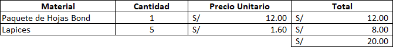
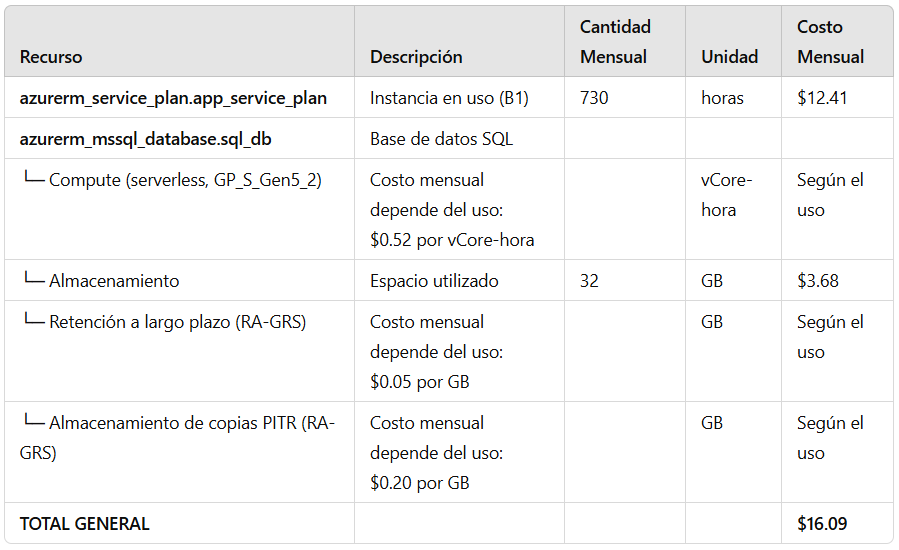
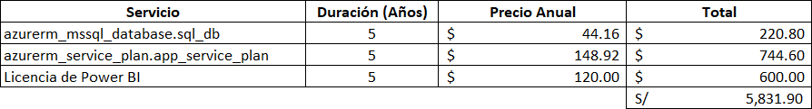

# UNIVERSIDAD PRIVADA DE TACNA  
## FACULTAD DE INGENIERÍA  
### Escuela Profesional de Ingeniería de Sistemas

**Plataforma de análisis de datos de matriculados en la carrera de Ingeniería de Sistemas para la Universidad Privada de Tacna - PAMIS**

Curso: *Inteligencia de Negocios*  
Docente: *Mag. Patrick Cuadros Quiroga*

**Integrantes:**

Agreda Ramirez, Jesus Eduardo  &emsp;&emsp;&emsp;&emsp;- &emsp;  (2021069823)
 Castañeda Centurion, Jorge Enrique &emsp; - &emsp; (2021069822)
 Contreras Lipa Alvaro Javier &emsp;&emsp;&emsp;&emsp;&emsp;&ensp; - &emsp;  (2021070020)
 Malaga Espinoza, Ivan Francisco &emsp;&emsp;&ensp; - &emsp; (2021071086)
 Ortiz Fernandez, Ximena Andrea &emsp;&emsp;&ensp; - &emsp;  (2021071080)

**Tacna – Perú**  
***2024***

\pagebreak

# **Informe de Proyecto**

**Plataforma de análisis de datos de matriculados en la carrera de Ingeniería de Sistemas para la Universidad Privada de Tacna - PAMIS**

**Versión 3.0**

## **Control de Versiones**

| Versión | Hecha por | Revisada por | Aprobada por | Fecha      | Motivo           |
| :-----: | --------- | ------------ | ------------ | ---------- | ---------------- |
| 1.0     | JCC       | ACL          | JAR          | 27/08/2024 | Versión Original |
| 2.0     | XOF       | JAR          | IME          | 15/11/2024 | Versión Original |
| 3.0     | JAR       | XOF          | JCC          | 15/11/2024 | Versión Original |

\pagebreak

## **Índice General**

## **Índice General**

1. [Antecedentes](#1)  

2. [Planteamiento del Problema](#2)  
   2.1 Problema  
   2.2 Justificación  
   2.3 Alcance  

3. [Objetivos](#3)  

4. [Marco Teórico](#4)  

5. [Desarrollo de la Solución](#5)  
   5.1 Análisis de Factibilidad  
   5.2 Tecnología de Desarrollo  
   5.3 Metodología de Implementación  

6. [Cronograma](#6)  

7. [Presupuesto](#7)  

8. [Conclusiones](#8)  

9. [Anexos](#9)  

\pagebreak

# **Informe Final**

## 1. Antecedentes 

La Plataforma de Análisis de Matriculados en Ingeniería de Sistemas (PAMIS) nace como respuesta a la necesidad de mejorar la toma de decisiones académicas dentro de la Escuela Profesional de Ingeniería de Sistemas de la Universidad Privada de Tacna. En el entorno educativo actual, el acceso a datos detallados y personalizados es crucial para optimizar el rendimiento académico y la gestión institucional.

### Contexto:
*  En las instituciones educativas, el análisis de datos académicos ha adquirido una relevancia creciente, permitiendo identificar tendencias y patrones clave para la toma de decisiones estratégicas.
* PAMIS se alinea con esta necesidad al ofrecer una herramienta analítica que facilita el análisis de rendimiento académico, tasas de matriculación, índices de deserción y desempeño por curso.
* La plataforma está diseñada con tecnologías modernas como Power BI y servicios en la nube de Azure, garantizando una experiencia interactiva y accesible para estudiantes, docentes y administradores.

### Justificación Histórica:
* Se identificó la falta de herramientas específicas que permitan a los estudiantes visualizar su progreso académico y a la administración tomar decisiones basadas en datos. PAMIS busca llenar este vacío, apoyándose en metodologías modernas de análisis de datos​

## 2. Planteamiento del problema 

 ### Problema
En la actualidad, los estudiantes de la Escuela Profesional de Ingeniería de Sistemas de la Universidad Privada de Tacna (UPT) enfrentan diversos desafíos en la gestión de su rendimiento académico. Estos desafíos incluyen la falta de herramientas adecuadas para acceder a estadísticas detalladas sobre los cursos, la dificultad para tomar decisiones informadas basadas en datos claros y la ausencia de una plataforma centralizada para visualizar su progreso académico.

* Falta de acceso a información académica personalizada: La escuela dispone de un sistema administrativo que gestiona las estadísticas académicas a nivel institucional. Sin embargo, los estudiantes no tienen acceso directo a una plataforma que les permita visualizar de manera clara y personalizada datos como tasas de aprobación, índices de deserción y distribución de calificaciones en los cursos que les interesan. Esto limita su capacidad para evaluar y planificar su trayectoria académica de manera efectiva.
* Dificultades para tomar decisiones informadas: La carencia de herramientas accesibles y comprensibles para los estudiantes implica que deben tomar decisiones basadas en percepciones o información incompleta. Esta situación puede llevar a una planificación académica menos eficaz y a un rendimiento subóptimo en los cursos.
* Impacto en el rendimiento académico: Sin acceso a una visión detallada y precisa de su rendimiento académico, los estudiantes pueden enfrentar dificultades para identificar áreas de mejora y ajustar su enfoque de estudio, lo que afecta negativamente su desempeño y progreso académico.
* Necesidad de una plataforma de visualización de datos: Es fundamental desarrollar una herramienta analítica que permita a los estudiantes acceder a estadísticas relevantes y personalizadas sobre los cursos. Esta plataforma debería facilitar la toma de decisiones informadas, mejorar la planificación académica y optimizar el rendimiento académico de los estudiantes.

### Justificación
La implementación de PAMIS busca abordar estos problemas mediante:
* Acceso centralizado: Proporcionar a estudiantes y docentes una plataforma intuitiva que integre datos académicos clave.
* Visualización interactiva: Ofrecer gráficos y reportes detallados que faciliten la identificación de áreas críticas y la planificación académica.
* Toma de decisiones informadas: Apoyar a la administración en la optimización de recursos y estrategias académicas​

### Alcance
#### Inclusiones:
Desarrollo de una Aplicación en PowerBI:
* Creación de un dashboard interactivo en PowerBI que facilite la exploración visual de los datos académicos.
* Implementación de funcionalidades que permitan a los usuarios visualizar datos de matriculación, rendimiento académico y tasas de aprobación mediante gráficos dinámicos y tablas detalladas en PowerBI.

Funcionalidades Clave:
* Análisis detallado de los datos de matrículas, rendimiento académico y otros indicadores clave dentro del entorno de PowerBI.
* Exploración interactiva de los datos a través de visualizaciones en PowerBI para identificar patrones y tendencias que puedan guiar la toma de decisiones.

Soporte Tecnológico:
* Integración de capacidades avanzadas de análisis de datos y visualización en PowerBI para un rendimiento óptimo.
* Mantenimiento y actualizaciones continuas del dashboard en PowerBI, basadas en el feedback de los usuarios y las necesidades emergentes.
#### Exclusiones:
* Servicios Educativos Directos: PAMIS no proporcionará servicios educativos directos ni consultas académicas personalizadas.
* Gestión de Otros Programas Académicos: El enfoque estará limitado a la Ingeniería de Sistemas, y no se incluirá la gestión de otros programas académicos.
* Soporte Legal o Administrativo: La plataforma no ofrecerá asistencia legal ni soporte administrativo más allá del análisis de datos académicos.
* Soporte para Dispositivos Móviles: PAMIS no ofrecerá soporte ni optimización para dispositivos móviles, enfocándose únicamente en entornos de escritorio a través de PowerBI.

## 3. Objetivos 

### Objetivo general
Desarrollar una plataforma de análisis de datos de matriculados en la carrera de ingeniería de sistemas para la universidad privada de Tacna que permita a sus estudiantes y docentes, acceder a estadísticas detalladas sobre los cursos, con el fin de mejorar la toma de decisiones académicas y optimizar su rendimiento.
### Objetivos Específicos
#### Análisis de Matrículas:
* Objetivo: Proporcionar una visión clara sobre las tasas de matriculación y su evolución a lo largo del tiempo para identificar tendencias y patrones de inscripción.
* Meta: Facilitar la identificación de picos o caídas en las matrículas, ayudando en la planificación de recursos y estrategias de captación.
#### Desempeño Académico por Curso:
* Objetivo: Evaluar el rendimiento académico en cada curso a través de la visualización de tasas de aprobación y calificaciones.
* Meta: Ofrecer a los estudiantes una comprensión detallada de su desempeño y motivarlos a mejorar en áreas específicas.
#### Análisis Comparativo entre Cohortes:
* Objetivo: Realizar comparaciones del rendimiento académico entre diferentes generaciones de estudiantes para identificar cambios y tendencias a lo largo del tiempo.
* Meta: Proporcionar información que ayude a entender cómo diferentes cohortes responden a los planes de estudio y a las metodologías de enseñanza.
#### Identificación de Áreas Críticas:
* Objetivo: Detectar cursos o áreas académicas con un alto índice de desaprobación para implementar estrategias de mejora.
* Meta: Informar a la administración y a los docentes sobre los cursos que requieren atención adicional, promoviendo acciones correctivas oportunas.
#### Análisis de Matriculados por Docente:
* Objetivo: Evaluar el rendimiento de los estudiantes en relación con los docentes a través de la tasa de aprobación y la probabilidad de éxito.
* Meta: Proporcionar información valiosa sobre la efectividad docente y permitir ajustes en la asignación de cursos, buscando mejorar la experiencia académica.

## 4. Marco Teórico 
### 4.1 Análisis de Datos Académicos
El análisis de datos académicos implica la recopilación, procesamiento y visualización de datos relacionados con el rendimiento estudiantil, matrícula y tasas de aprobación. Herramientas como Power BI permiten:
* Identificar patrones y tendencias en datos históricos.
* Facilitar la toma de decisiones basadas en información estadística confiable.
* Optimizar recursos académicos mediante análisis predictivos y comparativos​.
### 4.2 Toma de Decisiones Informadas
El proyecto se basa en el modelo de toma de decisiones basado en datos (Data-Driven Decision Making), el cual sugiere que el uso de información clara y estructurada mejora significativamente los resultados académicos y administrativos. Este enfoque:
* Reduce la dependencia de decisiones subjetivas o intuitivas.
* Incrementa la eficiencia en la asignación de recursos.
* Mejora los indicadores educativos clave como tasas de deserción y aprobación​.
### 4.3 Visualización de Datos
La visualización de datos es un pilar central de PAMIS. Mediante el uso de dashboards interactivos en Power BI, se permite a los usuarios explorar los datos académicos de manera intuitiva, comprendiendo métricas clave como:
* Evolución de matrículas.
* Desempeño por curso y docente.
* Comparaciones entre cohortes estudiantiles. Esta metodología fomenta el análisis exploratorio y la generación de estrategias personalizadas​.
### 4.4 Tecnología en la Educación Superior
El uso de plataformas digitales como PAMIS en la educación superior ha demostrado:
* Incremento en el compromiso de los estudiantes con su proceso de aprendizaje.
* Mejora en la planificación académica mediante datos concretos.
* Mayor transparencia y accesibilidad en la gestión de datos institucionales​.
### 4.5 Normativas y Privacidad de Datos
La implementación de PAMIS considera estrictamente la Ley de Protección de Datos Personales (Ley N° 29733) en Perú, garantizando:
* La confidencialidad y seguridad de los datos académicos.
* Cumplimiento de políticas internas de la Universidad Privada de Tacna relacionadas con el uso y almacenamiento de datos estudiantiles

## 5. Desarrollo de la Solución 
### a. Análisis de Factibilidad

#### Factibilidad Social
El proyecto PAMIS se alinea con los valores y códigos de conducta de la UPT y del entorno social en el que opera. Al proporcionar a los estudiantes una herramienta que les permita tomar decisiones académicas informadas, el proyecto contribuirá al desarrollo académico y personal de los estudiantes, promoviendo una cultura de mejora continua y éxito académico.
Además, al enfocarse en la personalización de la experiencia educativa, el proyecto responde a las necesidades y expectativas sociales actuales de acceso a la información y toma de decisiones basadas en datos.
#### Factibilidad Económica
Se definieron los siguientes costos:
##### Costos Generales

Tabla 01: En Costos Generales se detallan las utilidades con sus cantidades y precios haciendo un total de S/20.00 

##### Costos operativos durante el desarrollo 

Tabla 02: En Costos Operativos se detallan los servicios utilizados durante el desarrollo de PAMIS. Convertido a soles y calculado con los meses de desarrollo nos da un total de S/120.00.

##### Costos del ambiente

Tabla 03: En Costos del Ambiente se muestran los costos de almacenamiento, servidor web y licencia para la publicación del informe en Power BI por 5 años.

##### Costos de personal

Tabla 04: El Costo de Personal detallado muestra los días por mes, las horas por día y el pago por hora y día de todo el personal, finalizando con el total de su pago mensual.

Tabla 05: El Costo de Personal muestra los salarios mensuales y totales de 2 meses para el desarrollo de PAMIS, con un costo total combinado de S/ 10,248.00

#### Factibilidad Operativa
* Beneficios del Producto: El proyecto PAMIS proporcionará una plataforma analítica que permite a los estudiantes de la Escuela Profesional de Ingeniería de Sistemas de la Universidad Privada de Tacna acceder a estadísticas detalladas sobre los cursos. Esto mejorará la toma de decisiones académicas, optimizará el rendimiento estudiantil y proporcionará una experiencia educativa más personalizada. Además, al centralizar la información, se facilitará la planificación académica y se reducirá la carga administrativa asociada con la consulta y manejo de datos.
* Impacto en los Usuarios: Los estudiantes se beneficiarán al poder acceder a datos precisos y personalizados sobre su rendimiento académico. Esto les permitirá tomar decisiones más informadas sobre su trayectoria educativa, lo que puede resultar en un mejor rendimiento académico y una planificación más efectiva.
#### Factibilidad Técnica
##### Hardware Disponible
Equipos de Desarrollo: Se necesitan equipos de desarrollo capaces de ejecutar software de desarrollo web y herramientas de análisis de datos, los materiales previamente mencionados cumplen con las especificaciones mínimas requeridas:
* Procesador: Intel Core i5 de 4 núcleos, útil para el manejo de tareas de programación, depuración y pruebas.
* Memoria RAM: De 8 a 16 GB de memoria DDR4 expandible.
* Almacenamiento: Disco duro sólido (SSD) para el sistema operativo, esto asegura tiempos de carga cada vez más cortos con un óptimo rendimiento general.
* Tarjeta Gráfica: Se usa la tarjeta gráfica integrada en el procesador Intel, pero también podemos hacer uso de una GPU dedicada como la Nvidia RTX 3050.
##### Software
* Aplicaciones y Herramientas de Desarrollo:
Visual Studio Code: Es el IDE principal para el desarrollo del proyecto, siendo compatible con los sistemas operativos Windows y macOS, ofreciendo extensiones que personalizan el entorno de trabajo.
* Terraform: Utilizado para la creación y gestión automatizada de la infraestructura en Azure, asegurando consistencia y escalabilidad.
* Power BI: Herramienta para la creación de dashboards interactivos y visualización de datos conectada directamente al almacén de datos en Azure.
* Azure Data Factory: Implementado para gestionar pipelines de datos automatizados que integran y transforman información desde las fuentes hacia el almacén de datos.
* Azure Synapse Analytics: Utilizado como almacén de datos centralizado y para realizar análisis avanzados en grandes volúmenes de datos.
* Azure DevOps: Plataforma para la gestión de repositorios, pipelines de CI/CD y control de versiones de los artefactos generados.
* Azure SQL Database: Base de datos transaccional utilizada para la gestión de datos académicos.
* Navegadores Web: La plataforma debe ser compatible con los navegadores web más conocidos y utilizados tales como Google Chrome, Mozilla Firefox, Microsoft Edge, etc.
##### Infraestructura en la Nube
* Grupo de Recursos: Contenedor lógico llamado inteligencia-negocios, que organiza todos los recursos relacionados en la ubicación East US.
* Azure SQL Server: Servidor principal para alojar la base de datos SQL, donde las credenciales son gestionadas de forma segura mediante Azure Key Vault. (Versión utilizada: SQL Server 12.0.)

* Azure SQL Database: Base de datos llamada CICLO_UNIVERSITARIO, con una capacidad de hasta 32 GB de almacenamiento, una capacidad minima de 0.5 vCores para ahorrar costos cuando está inactiva y cuenta con una auto-pausa que se activa tras 60 minutos de inactividad.
* Azure Data Factory: Automatización de procesos ETL para cargar y transformar datos desde sistemas de origen hacia Azure SQL Database y Synapse Analytics.
* Azure Synapse Analytics: Almacén de datos centralizado para integrar y analizar grandes volúmenes de información académica. Optimizado para consultas analíticas rápidas conectadas a Power BI.
* Terraform: Infraestructura definida como código para garantizar consistencia y despliegue automatizado de recursos en Azure.
* Azure Key Vault: Gestión segura de credenciales y secretos, como contraseñas y claves de acceso, utilizadas en los diferentes servicios de Azure.
* Azure DevOps: Pipelines de CI/CD configurados para despliegues automatizados y gestión de versiones de artefactos generados.
##### Automatización
La creación y el despliegue de los recursos en Azure se gestionan mediante Terraform, lo que asegura que los entornos de desarrollo, pruebas y producción se configuren de forma uniforme.
Los pipelines de CI/CD en Azure DevOps integran los artefactos generados, como scripts SQL, configuraciones de Data Factory y dashboards de Power BI, garantizando actualizaciones consistentes y seguras.

##### Infraestructura de Red
* Conexión a Internet: Una conexión a internet de alta velocidad es esencial para garantizar la disponibilidad y el acceso continuo a los servicios en la nube. Esto es especialmente crítico para la operación de Azure Data Factory y las consultas en tiempo real hacia Azure Synapse Analytics.

#### Factibilidad Ambiental
Desde una perspectiva ambiental, el proyecto PAMIS tendrá un impacto mínimo en el medio ambiente, ya que se trata de una solución digital que no requiere de infraestructura física adicional. El proyecto contribuirá al compromiso de la UPT con la sostenibilidad al minimizar el uso de papel y otros recursos físicos, promoviendo la digitalización y el acceso en línea a la información académica.

### b. Tecnología de Desarrollo 

### c. Metodología de Implementación
Para la implementación de la plataforma de análisis de datos PAMIS se utilizará la metodología ágil Scrum, que permite un desarrollo iterativo, incremental y colaborativo. Facilitando la adaptación a los requerimientos del cliente y la entrega de productos funcionales en ciclos cortos.

#### Fases de implementación
#### 1. Fase 1: Preparación y Configuración del Entorno
- Creación del Grupo de Recursos: 
   - Configuración del grupo de recursos "inteligencia-negocios" en la región East US.

- Configuración del Servidor SQL:
   - Implementación del servidor SQL "bi-segunda-unidad" con versión 12.0.

   - Configuración del usuario administrador (adminsql) y contraseña.

- Creación de la Base de Datos:
   - Base de datos "CICLO_UNIVERSITARIO" con:
      - Capacidad de almacenamiento: 32 GB.
      - Capacidad mínima: 0.5 vCores (para ahorro en inactividad).
      - Auto-pausa: 60 minutos.

- Infraestructura de Aplicación:
   - Creación del App Service Plan en Linux.
   - Despliegue del servicio web "UploadCSV-unique123" con contenedor Docker.

#### 2. Fase 2: Extracción, Transformación y Carga (ETL)
- Extracción de Datos:
   - Subida de archivos CSV a través del servicio web "UploadCSV-unique123".

   - Almacenamiento en la base de datos "CICLO_UNIVERSITARIO" en Azure SQL.

- Transformación de Datos:
   - Limpieza y estructuración de datos dentro de Azure SQL mediante consultas SQL optimizadas.

#### 3. Fase 3: Visualización y Desarrollo de Dashboards
- Conexión de Power BI:
   - Configuración de la conexión entre Power BI y la base de datos Azure SQL.

- Desarrollo de Dashboards:
   - Creación de visualizaciones interactivas:
      - Tasas de matriculación: Evolución de inscripciones en el tiempo.
      - Rendimiento académico: Análisis por curso, cohorte y docente.
      - Áreas críticas: Identificación de cursos con alta tasa de desaprobación.

   - Implementación de fórmulas DAX para cálculos personalizados.

   - Optimización del modelo de datos para asegurar rendimiento en los reportes.

#### 4. Fase 4: Pruebas y Validación
- Pruebas de Funcionalidad:
   - Validación del flujo de datos desde el servicio UploadCSV hasta la base de datos y Power BI.

- Pruebas de Rendimiento:
   - Optimización de consultas SQL y validación de tiempos de respuesta.

#### 5. Fase 5: Despliegue y Monitoreo
- Publicación del Dashboard en Power BI Service:
   - Configuración de accesos y permisos a usuarios finales.

- Monitoreo del Desempeño:
   - Uso de herramientas de Azure para monitorear la base de datos y la aplicación.
   - Mantenimiento periódico y ajustes de optimización en Power BI.

### Cronograma

### Presupuesto

### Conclusiones
- Optimización en la Toma de Decisiones Académicas La implementación de PAMIS permite a estudiantes, docentes y administradores acceder a datos detallados sobre matrículas y rendimiento académico. Esto facilita la toma de decisiones informadas, mejorando la planificación y el desempeño estudiantil.

- Centralización de la Información PAMIS centraliza datos críticos en un solo sistema, eliminando la dependencia de procesos manuales y descentralizados. Esto reduce la carga administrativa y garantiza una mayor eficiencia en la gestión académica.

- Impacto en el Rendimiento Estudiantil Al proporcionar acceso a estadísticas detalladas y personalizadas, la plataforma fomenta la identificación de áreas de mejora, motivando a los estudiantes a optimizar su desempeño académico y reduciendo índices de deserción.

- Cumplimiento Legal y Seguridad de Datos PAMIS cumple con las normativas de protección de datos establecidas en la Ley N° 29733, garantizando la seguridad y confidencialidad de la información académica y personal de los usuarios.

- Escalabilidad y Adaptabilidad del Sistema El diseño modular y el uso de tecnologías modernas como Azure y Power BI aseguran la escalabilidad del sistema, permitiendo la incorporación de nuevas funcionalidades según las necesidades futuras de la institución.

- Contribución al Mejoramiento Educativo PAMIS apoya la mejora continua de los programas académicos, ofreciendo datos estratégicos que permiten a la institución implementar cambios efectivos en los planes de estudio y metodologías de enseñanza.